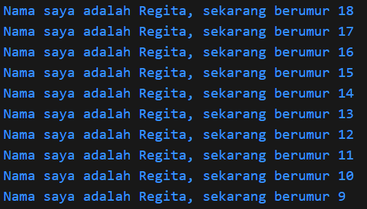

### Nama    : Regita Delya Putri
### Absen   : 21
### NIM     : 2241720137
### Kelas   : TI 3F

# Soal 1
Modifikasilah kode pada baris 3 di VS Code atau Editor Code favorit Anda berikut ini agar mendapatkan keluaran (output) sesuai yang diminta!
~~~
void main() { 
   for (int i = 18; i > 8; i--) { 
     print('Nama saya adalah Regita, sekarang berumur ${i}'); 
   } 
}
~~~

Output:

# Soal 2
Mengapa sangat penting untuk memahami bahasa pemrograman Dart sebelum kita menggunakan framework Flutter ? Jelaskan!
## Jawaban: 
Memahami bahasa pemrograman Dart penting sebelum menggunakan Flutter karena:
1. Dasar Flutter: Flutter dibangun menggunakan Dart, jadi memahaminya adalah dasar untuk mengembangkan aplikasi Flutter.
2. Sintaks dan Struktur Kode: Mengetahui sintaks dan konsep Dart, seperti classes dan async programming, membantu menulis kode Flutter yang baik.
3. Pengelolaan Widget dan State: Dart digunakan untuk mengelola widget dan state di Flutter, yang merupakan inti dari pengembangan UI.
4. Kinerja dan Debugging: Memahami Dart membantu menulis kode yang lebih efisien dan mudah untuk di-debug.
5. Pemrograman Asinkron: Dart memiliki pendekatan khusus untuk pemrograman asinkron yang penting untuk operasi latar belakang di Flutter.

# Soal 3
Rangkumlah materi dari codelab ini menjadi poin-poin penting yang dapat Anda gunakan untuk membantu proses pengembangan aplikasi mobile menggunakan framework Flutter
## Jawaban:
Bahasa Dart adalah inti dari framework Flutter. Diluncurkan pada tahun 2011, Dart telah berkembang sejak saat itu.Kerangka kerja modern seperti Flutter membutuhkan bahasa modern tingkat tinggi agar bisa memberikan pengalaman terbaik kepada pengembang, serta memungkinkan untuk membuat aplikasi seluler yang luar biasa. Memahami Dart adalah dasar untuk bekerja dengan Flutter; pengembang perlu mengetahui asal-usul bahasa Dart, bagaimana komunitas mengerjakannya, kelebihannya, dan mengapa itu adalah bahasa pemrograman yang dipilih untuk Flutter.

Fitur-fitur Dart:
1. Productive tooling
2. Garbage collection
3. Type annotations (opsional)
4. Statically typed
5. Portability

Semua pengembangan framework Flutter melibatkan pengetahuan/fitur mendalam dengan bahasa Dart; Kode aplikasi, kode plugin, dan manajemen dependensi semuanya menggunakan bahasa Dart beserta fitur-fiturnya.

Mengeksekusi kode dart dapat dilakukan dengan 2 cara yaitu
1. Dart virtual machines (VMs)
2. JavaScript compilations

Kode Dart dapat dieksekusi pada lingkungan yang mendukung bahasa Dart. Lingkungan yang mendukung bahasa Dart perlu memperhatikan fitur-fitur penting seperti berikut:

1. Runtime systems
2. Dart core libraries
3. Garbage collectors

Eksekusi kode Dart dapat beroperasi dalam dua mode — kompilasi Just-In-Time (JIT) atau Kompilasi Ahead-Of-Time (AOT).
1. Kompilasi JIT (Just-In-Time): Dart VM mengkompilasi kode sumber menjadi kode mesin asli saat aplikasi berjalan. Ini cocok untuk pengembangan karena mendukung debugging dan hot reload.
2. Kompilasi AOT (Ahead-Of-Time): Dart VM dan kode dikompilasi sebelumnya menjadi kode mesin, memberikan kinerja yang lebih baik, tetapi tanpa dukungan untuk debugging dan hot reload.

Object Orientation in Dart
Dart adalah bahasa pemrograman berorientasi objek (OOP) yang menggunakan konsep objek yang menyimpan data (fields) dan kode (methods). Objek dibuat dari cetak biru yang disebut class. Dart mendukung prinsip OOP seperti enkapsulasi, pewarisan, komposisi, abstraksi, dan polimorfisme. Jika Anda familiar dengan OOP di bahasa lain seperti Java, konsep di Dart akan mirip.

Dart Operators
Di Dart, operator adalah method dengan sintaks khusus. Misalnya, x == y sama dengan memanggil x.==(y). Semua tipe data di Dart adalah objek, sehingga operator bisa diubah sesuai kebutuhan.

1. Arithmetic Operators: +, -, *, /, ~/ (pembagian bilangan bulat), %, - (negasi).
2. Shortcut Operators: +=, -=, *=, /=, ~/=.
3. Increment & Decrement: ++var, var++, --var, var--.

Equality and Relational Operators
1. Equality: == (membandingkan isi, bukan referensi), !=.
2. Relational: >, <, >=, <=. Dart tidak memerlukan === karena type safety.

Logical Operators
1. ! (NOT)
2. || (OR)
3. && (AND)
