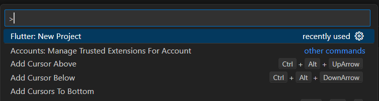
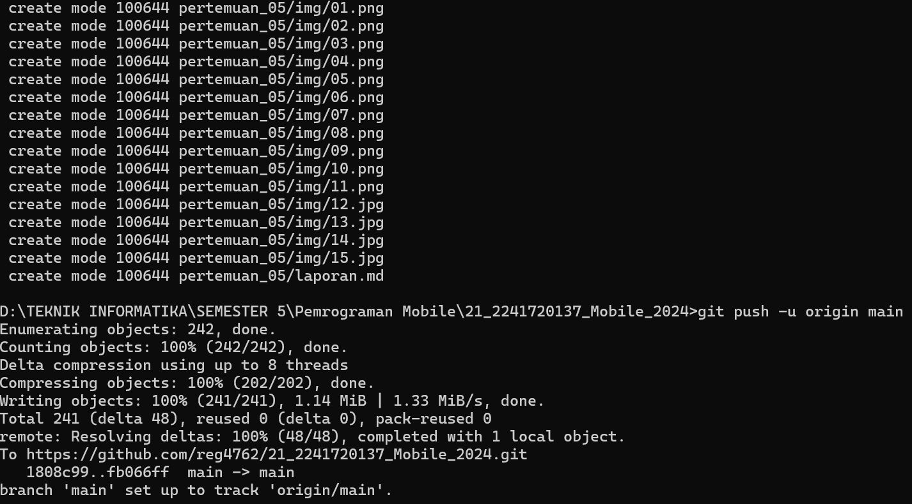

### Nama    : Regita Delya Putri
### Absen   : 21
### NIM     : 2241720137
### Kelas   : TI 3F
### Pertemuan: 4
---

# Praktikum 1: Membuat Project Flutter Baru
## Langkah 1
Membuat project application Flutter baru

## Langkah 2
Memilih folder tempat menyimpan project ini

## Langkah 3
Buat nama project flutter hello_world

## Langkah 4
Output: 

# Praktikum 2: Menghubungkan Perangkat Android atau Emulator
Menjalankan aplikasi di perangkat Android menggunakan Wi-Fi

## Langkah 1
Di Android Studio, pilih Pair Devices Using Wi-Fi 

Dialog Pair devices over Wi-Fi akan terbuka

## Langkah 2
Buka Developer options, scroll ke bawah ke bagian Debugging, lalu aktifkan Wireless debugging.

Pada pop-up Izinkan proses debug nirkabel di jaringan ini?, pilih Allow.

## Langkah 3
Kemudian sambungkan device menggunakan QR code dengan menscannya

## Langkah 4

Lalu Run main.dart pada windows dan tunggu prosesnya selesai

Pada Handphone akan tampil programnya

# Praktikum 3: Membuat Repository GitHub dan Laporan Praktikum
## Langkah 1
Add ke repository

## Langkah 2
Commit ke repository

## Langkah 3
Push ke repository

## Langkah 4
Running project hello_world dengan tekan F5 atau Run > Start Debugging

# Praktikum 4: Menerapkan Widget Dasar
## Langkah 1: Text Widget
Buat folder baru basic_widgets di dalam folder lib. Kemudian buat file baru di dalam basic_widgets dengan nama text_widget.dart

Lakukan import file text_widget.dart ke main.dart

## Langkah 2: Image Widget
Buat sebuah file image_widget.dart di dalam folder basic_widgets. Disini saya mengatur ukuran gambarnya agar tidak terlalu besar

Lakukan penyesuaian asset pada file pubspec.yaml dan tambahkan file logo Anda di folder assets project hello_world.

Output

# Praktikum 5: Menerapkan Widget Material Design dan iOS Cupertino
## Langkah 1: Cupertino Button dan Loading Bar
~~~
import 'package:flutter/cupertino.dart';
import 'package:flutter/material.dart';

class LoadingCupertino extends StatelessWidget {
  const LoadingCupertino({Key? key}) : super(key: key);

  @override
  Widget build(BuildContext context) {
    return MaterialApp(
      home: Container(
        margin: const EdgeInsets.only(top: 30),
        color: Colors.white,
        child: Column(
          children: <Widget>[
            CupertinoButton(
              child: const Text("Contoh button"),
              onPressed: () {},
            ),
            const CupertinoActivityIndicator(),
          ],
        ),
      ),
    );
  }
}
~~~

## Langkah 2: Floating Action Button (FAB)
~~~
import 'package:flutter/material.dart';

class FabWidget extends StatelessWidget {
  const FabWidget({Key? key}) : super(key: key);

  @override
  Widget build(BuildContext context) {
    return MaterialApp(
      home: Scaffold(
        floatingActionButton: FloatingActionButton(
          onPressed: () {
            // Add your onPressed code here!
          },
          child: const Icon(Icons.thumb_up),
          backgroundColor: Colors.pink,
        ),
      ),
    );
  }
}
~~~

## Langkah 3: Scaffold Widget
~~~
import 'package:flutter/material.dart';

void main() {
  runApp(const MyApp());
}

class MyApp extends StatelessWidget {
  const MyApp({Key? key}) : super(key: key);

  // This widget is the root of your application.
  @override
  Widget build(BuildContext context) {
    return MaterialApp(
      title: 'Flutter Demo',
      theme: ThemeData(
        primarySwatch: Colors.red,
      ),
      home: const MyHomePage(title: 'My Increment App'),
    );
  }
}

class MyHomePage extends StatefulWidget {
  const MyHomePage({Key? key, required this.title}) : super(key: key);

  final String title;

  @override
  State<MyHomePage> createState() => _MyHomePageState();
}

class _MyHomePageState extends State<MyHomePage> {
  int _counter = 0;

  void _incrementCounter() {
    setState(() {
      _counter++;
    });
  }

  @override
  Widget build(BuildContext context) {
    return Scaffold(
      appBar: AppBar(
        title: Text(widget.title),
      ),
      body: Center(
        child: Column(
          mainAxisAlignment: MainAxisAlignment.center,
          children: <Widget>[
            const Text(
              'You have pushed the button this many times:',
            ),
            Text(
              '$_counter',
              style: Theme.of(context).textTheme.headlineSmall,
            ),
          ],
        ),
      ),
      bottomNavigationBar: BottomAppBar(
        child: Container(
          height: 50.0,
        ),
      ),
      floatingActionButton: FloatingActionButton(
        onPressed: _incrementCounter,
        tooltip: 'Increment Counter',
        child: const Icon(Icons.add),
      ), 
      floatingActionButtonLocation: FloatingActionButtonLocation.centerDocked,
    );
  }
}
~~~

Output:

## Langkah 4: Dialog Widget
~~~
import 'package:flutter/material.dart';

void main() {
  runApp(const MyApp());
}
class MyApp extends StatelessWidget {
  const MyApp({Key? key}) : super(key: key);

  @override
  Widget build(BuildContext context) {
    return const MaterialApp(
      home: Scaffold(
        body: MyLayout(),
      ),
    );
  }
}

class MyLayout extends StatelessWidget {
  const MyLayout({Key? key}) : super(key: key);

  @override
  Widget build(BuildContext context) {
    return Padding(
      padding: const EdgeInsets.all(8.0),
      child: ElevatedButton(
        child: const Text('Show alert'),
        onPressed: () {
          showAlertDialog(context);
        },
      ),
    );
  }
}

showAlertDialog(BuildContext context) {
  // set up the button
  Widget okButton = TextButton(
    child: const Text("OK"),
    onPressed: () {
      Navigator.pop(context);
    },
  );

  // set up the AlertDialog
  AlertDialog alert = AlertDialog(
    title: const Text("My title"),
    content: const Text("This is my message."),
    actions: [
      okButton,
    ],
  );

  // show the dialog
  showDialog(
    context: context,
    builder: (BuildContext context) {
      return alert;
    },
  );
}
~~~

Output:

Dapat menampilkan pesan alert, tombol OK akan menutup dialog.

## Langkah 5: Input dan Selection Widget
~~~
import 'package:flutter/material.dart';

void main() {
  runApp(const MyApp());
}
class MyApp extends StatelessWidget {
  const MyApp({Key? key}) : super(key: key);

  @override
  Widget build(BuildContext context) {
    return MaterialApp(
      home: Scaffold(
        appBar: AppBar(title: const Text("Contoh TextField")),
        body: const TextField(
          obscureText: false,
          decoration: InputDecoration(
            border: OutlineInputBorder(),
            labelText: 'Nama',
          ),
        ),
      ),
    );
  }
}
~~~

Output:

Dapat meginputkan teks.

## Langkah 6: Date and Time Pickers
~~~
import 'dart:async';
import 'package:flutter/material.dart';

void main() => runApp(const MyApp());

class MyApp extends StatelessWidget {
  const MyApp({Key? key}) : super(key: key);

  @override
  Widget build(BuildContext context) {
    return const MaterialApp(
      title: 'Contoh Date Picker',
      home: MyHomePage(title: 'Contoh Date Picker'),
    );
  }
}

class MyHomePage extends StatefulWidget {
  const MyHomePage({Key? key, required this.title}) : super(key: key);

  final String title;

  @override
  _MyHomePageState createState() => _MyHomePageState();
}

class _MyHomePageState extends State<MyHomePage> {
  // Variable/State untuk mengambil tanggal
  DateTime selectedDate = DateTime.now();

  //  Initial SelectDate FLutter
  Future<void> _selectDate(BuildContext context) async {
    // Initial DateTime FIinal Picked
    final DateTime? picked = await showDatePicker(
        context: context,
        initialDate: selectedDate,
        firstDate: DateTime(2015, 8),
        lastDate: DateTime(2101));
    if (picked != null && picked != selectedDate) {
      setState(() {
        selectedDate = picked;
      });
    }
  }

  @override
  Widget build(BuildContext context) {
    return Scaffold(
      appBar: AppBar(
        title: Text(widget.title),
      ),
      body: Center(
        child: Column(
          mainAxisSize: MainAxisSize.min,
          children: <Widget>[
            Text("${selectedDate.toLocal()}".split(' ')[0]),
            const SizedBox(
              height: 20.0,
            ),
            ElevatedButton(
              onPressed: () => {
                _selectDate(context),
                // ignore: avoid_print
                print(selectedDate.day + selectedDate.month + selectedDate.year)
              },
              child: const Text('Pilih Tanggal'),
            ),
          ],
        ),
      ),
    );
  }
}
~~~

Output:

Dapat mengatur dan mengganti tanggal

# Tugas Praktikum

## Percobaan membuat aplikasi baru

## Percobaan menambahkan Tombol

## Percobaan menambahkan padding pada text

## Percobaan mengatur tema dan gaya

## Percobaan mengganti warna pada tema

## Percobaan mengganti tema text

## Percobaan menempatkan UI di tengah

## Percobaan membuat tampilan lebih rapi

## Percobaan menambahkan tombol like

## Percobaan menambahkan kolom samping navigasi

## Percobaan setState

## Percobaan selectedIndex

## Percobaan membuat tampilan renponsif

## Percobaan menambahkan halaman baru

