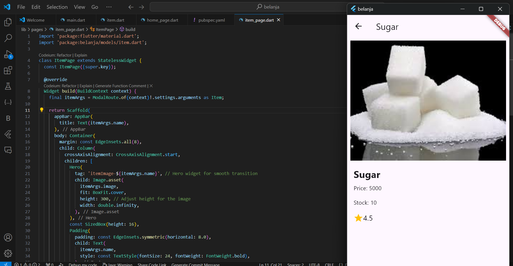

### Nama    : Regita Delya Putri
### Absen   : 21
### NIM     : 2241720137
### Kelas   : TI 3F
### Pertemuan: 6
---

# Praktikum 1: Membangun Layout di Flutter

# Praktikum 2: Implementasi button row

# Praktikum 3: Implementasi text section

# Praktikum 4: Implementasi image section

# Praktikum 5: Membangun Navigasi di Flutter
## Langkah 1: Siapkan project baru

## Langkah 2: Mendefinisikan Route

home_page.dart
~~~
import 'package:flutter/material.dart';

class HomePage extends StatelessWidget {
  @override
  Widget build(BuildContext context) {
    //TODO: implement build
    throw UnimplementedError();
  }
}
~~~

item_page.dart
~~~
import 'package:flutter/material.dart';

class ItemPage extends StatelessWidget {
  @override
  Widget build(BuildContext context) {
    // TODO: implement build
    throw UnimplementedError();
  }
}
~~~

## Langkah 3: Lengkapi Kode di main.dart

~~~
import 'package:flutter/material.dart';
import 'package:belanja/pages/home_page.dart';
import 'package:belanja/pages/item_page.dart';

void main() {
  runApp(MaterialApp(
    initialRoute: '/',
    routes: {
      '/': (context) => HomePage(),
      '/item': (context) => const ItemPage(),
    },
  ));
}
~~~

## Langkah 4: Membuat data model

~~~
class Item {
  String name;
  int price;

  Item({required this.name, required this.price});
}
~~~

## Tugas Praktikum 1

~~~
import 'package:flutter/material.dart';
import 'package:flutter/rendering.dart' show debugPaintSizeEnabled;

void main() {
  debugPaintSizeEnabled = false; // Set to true for visual layout.
  runApp(const MyApp());
}

class MyApp extends StatelessWidget {
  const MyApp({super.key});

  @override
  Widget build(BuildContext context) {
    return MaterialApp(
      title: 'Flutter layout demo',
      home: buildHomePage('Strawberry Pavlova Recipe'),
    );
  }

  Widget buildHomePage(String title) {
    const titleText = Padding(
      padding: EdgeInsets.all(20),
      child: Text(
        'Strawberry Pavlova',
        style: TextStyle(
          fontWeight: FontWeight.w800,
          letterSpacing: 0.5,
          fontSize: 30,
        ),
      ),
    );

    const subTitle = Text(
      'Pavlova is a meringue-based dessert named after the Russian ballerina '
      'Anna Pavlova. Pavlova features a crisp crust and soft, light inside, '
      'topped with fruit and whipped cream.',
      textAlign: TextAlign.center,
      style: TextStyle(
        fontFamily: 'Georgia',
        fontSize: 25,
      ),
    );

    // #docregion ratings, stars
    final stars = Row(
      mainAxisSize: MainAxisSize.min,
      children: [
        Icon(Icons.star, color: Colors.green[500]),
        Icon(Icons.star, color: Colors.green[500]),
        Icon(Icons.star, color: Colors.green[500]),
        const Icon(Icons.star, color: Colors.black),
        const Icon(Icons.star, color: Colors.black),
      ],
    );
    // #enddocregion stars

    final ratings = Container(
      padding: const EdgeInsets.all(20),
      child: Row(
        mainAxisAlignment: MainAxisAlignment.spaceEvenly,
        children: [
          stars,
          const Text(
            '170 Reviews',
            style: TextStyle(
              color: Colors.black,
              fontWeight: FontWeight.w800,
              fontFamily: 'Roboto',
              letterSpacing: 0.5,
              fontSize: 20,
            ),
          ),
        ],
      ),
    );
    // #enddocregion ratings

    // #docregion icon-list
    const descTextStyle = TextStyle(
      color: Colors.black,
      fontWeight: FontWeight.w800,
      fontFamily: 'Roboto',
      letterSpacing: 0.5,
      fontSize: 18,
      height: 2,
    );

    // DefaultTextStyle.merge() allows you to create a default text
    // style that is inherited by its child and all subsequent children.
    final iconList = DefaultTextStyle.merge(
      style: descTextStyle,
      child: Container(
        padding: const EdgeInsets.all(20),
        child: Row(
          mainAxisAlignment: MainAxisAlignment.spaceEvenly,
          children: [
            Column(
              children: [
                Icon(Icons.kitchen, color: Colors.green[500]),
                const Text('PREP:'),
                const Text('25 min'),
              ],
            ),
            Column(
              children: [
                Icon(Icons.timer, color: Colors.green[500]),
                const Text('COOK:'),
                const Text('1 hr'),
              ],
            ),
            Column(
              children: [
                Icon(Icons.restaurant, color: Colors.green[500]),
                const Text('FEEDS:'),
                const Text('4-6'),
              ],
            ),
          ],
        ),
      ),
    );
    // #enddocregion icon-list

    // #docregion left-column
    final leftColumn = Container(
      padding: const EdgeInsets.fromLTRB(20, 30, 20, 20),
      child: Column(
        children: [
          titleText,
          subTitle,
          ratings,
          iconList,
        ],
      ),
    );
    // #enddocregion left-column

    final mainImage = Image.asset(
      'images/pavlova.jpg',
      fit: BoxFit.cover,
    );

    return Scaffold(
      appBar: AppBar(
        title: Text(title),
      ),
      // #docregion body
      body: Center(
        child: Container(
          margin: const EdgeInsets.fromLTRB(0, 40, 0, 30),
          height: 600,
          child: Card(
            child: Row(
              crossAxisAlignment: CrossAxisAlignment.start,
              children: [
                SizedBox(
                  width: 440,
                  child: leftColumn,
                ),
                mainImage,
              ],
            ),
          ),
        ),
      ),
      // #enddocregion body
    );
  }
}
~~~

Output: 

## Langkah 5: Lengkapi kode di class HomePage

~~~
class HomePage extends StatelessWidget {
  final List<Item> items = [
    Item(name: 'Sugar', price: 5000),
    Item(name: 'Salt', price: 2000),
  ];
}
~~~

## Langkah 6: Membuat ListView dan itemBuilder

~~~
body: Container(
        margin: const EdgeInsets.all(8),
        child: ListView.builder(
          padding: const EdgeInsets.all(8),
          itemCount: items.length,
          itemBuilder: (context, index) {
            final item = items[index];
            return Card(
              child: Container(
                margin: const EdgeInsets.all(8),
                child: Row(
                  children: [
                    Expanded(child: Text(item.name)),
                    Expanded(
                      child: Text(
                        item.price.toString(),
                        textAlign: TextAlign.end,
                      ),
                    ),
                  ],
                ),
              ),
            );
          },
        ),
      ),
~~~

Output: 

## Langkah 7: Menambahkan aksi pada ListView

~~~
return InkWell(
  onTap: () {
    Navigator.pushNamed(context, '/item');
  },
  child: Card(
    child: Container(
      margin: const EdgeInsets.all(8),
      child: Row(
        children: [
          Expanded(child: Text(item.name)),
          Expanded(
            child: Text(
              item.price.toString(),
              textAlign: TextAlign.end,
            ),
          ),
        ],
      ),
    ),
  ),
);
~~~

Output: 

## Tugas Praktikum 2
1. Untuk melakukan pengiriman data ke halaman berikutnya, cukup menambahkan informasi arguments pada penggunaan Navigator

Output: 

2. Pembacaan nilai yang dikirimkan pada halaman sebelumnya dapat dilakukan menggunakan ModalRoute. Tambahkan kode berikut pada blok fungsi build dalam halaman ItemPage. Setelah nilai didapatkan, anda dapat menggunakannya seperti penggunaan variabel pada umumnya.
~~~
@override
  Widget build(BuildContext context) {
    final itemArgs = ModalRoute.of(context)!.settings.arguments as Item;

    return Scaffold(
      appBar: AppBar(
        title: const Text('Shoping List'),
      ),
      body: Container(
        margin: const EdgeInsets.all(8),
        child: Center(
          child: Text("${itemArgs.name} with ${itemArgs.price}"),
        ),
      ),
    );
  }
~~~

Outputnya jika menekan salah satu list item maka akan diarahkan ke halaman item tersebut: 

3. Pada hasil akhir dari aplikasi belanja yang telah anda selesaikan, tambahkan atribut foto produk, stok, dan rating. Ubahlah tampilan menjadi GridView seperti di aplikasi marketplace pada umumnya.

home_page.dart

~~~
import 'package:belanja/models/item.dart';
import 'package:flutter/material.dart';

class HomePage extends StatelessWidget {
  final List<Item> items = [
    Item(name: 'Sugar', price: 5000, image: 'images/sugar.jpeg', stock: 10, rating: 4.5),
    Item(name: 'Salt', price: 2000, image: 'images/salt.jpeg', stock: 20, rating: 4.0),
    Item(name: 'rice', price: 9000, image: 'images/rice.jpeg', stock: 25, rating: 4.7),
    // Tambahkan item lainnya
  ];

  @override
  Widget build(BuildContext context) {
    return Scaffold(
      appBar: AppBar(
        title: const Text('Shopping List'),
      ),
      body: Container(
        margin: const EdgeInsets.all(8),
        child: GridView.builder(
          gridDelegate: const SliverGridDelegateWithFixedCrossAxisCount(
            crossAxisCount: 2, // Menampilkan 2 item per baris
            crossAxisSpacing: 8,
            mainAxisSpacing: 8,
            childAspectRatio: 0.8, // Mengatur rasio tampilan card
          ),
          padding: const EdgeInsets.all(8),
          itemCount: items.length,
          itemBuilder: (context, index) {
            final item = items[index];
            return InkWell(
              onTap: () {
                Navigator.pushNamed(context, '/item', arguments: item);
              },
              child: Card(
                child: Column(
                  crossAxisAlignment: CrossAxisAlignment.start,
                  children: [
                    Expanded(
                      child: Image.asset(
                        item.image,
                        fit: BoxFit.cover, // Sesuaikan gambar
                      ),
                    ),
                    Padding(
                      padding: const EdgeInsets.all(8.0),
                      child: Text(
                        item.name,
                        style: const TextStyle(fontSize: 16, fontWeight: FontWeight.bold),
                      ),
                    ),
                    Padding(
                      padding: const EdgeInsets.symmetric(horizontal: 8),
                      child: Text('Price: ${item.price}'),
                    ),
                    Padding(
                      padding: const EdgeInsets.symmetric(horizontal: 8),
                      child: Text('Stock: ${item.stock}'),
                    ),
                    Padding(
                      padding: const EdgeInsets.symmetric(horizontal: 8),
                      child: Row(
                        children: [
                          const Icon(Icons.star, color: Colors.amber, size: 16),
                          Text('${item.rating}'),
                        ],
                      ),
                    ),
                  ],
                ),
              ),
            );
          },
        ),
      ),
    );
  }
}
~~~

Output:

4. Silakan implementasikan Hero widget pada aplikasi belanja Anda
~~~
import 'package:flutter/material.dart';
import 'package:belanja/models/item.dart';

class ItemPage extends StatelessWidget {
  const ItemPage({super.key});

  @override
  Widget build(BuildContext context) {
    final itemArgs = ModalRoute.of(context)!.settings.arguments as Item;

    return Scaffold(
      appBar: AppBar(
        title: const Text('Shopping List'),
      ),
      body: Container(
        margin: const EdgeInsets.all(8),
        child: Column(
          crossAxisAlignment: CrossAxisAlignment.start,
          children: [
            Hero(
              tag: 'itemImage-${itemArgs.name}',
              child: Image.asset(
                itemArgs.image, 
                fit: BoxFit.cover,
                height: 300, // Sesuaikan tinggi gambar
                width: double.infinity,
              ),
            ),
            const SizedBox(height: 16),

          ],
        ),
      ),
    );
  }
}
~~~

Output:

5. Sesuaikan dan modifikasi tampilan sehingga menjadi aplikasi yang menarik.

Output:

