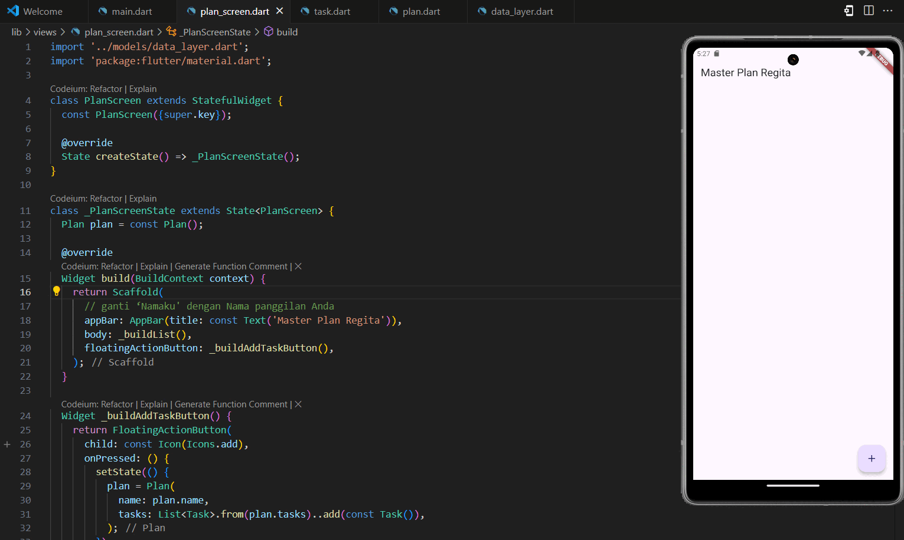
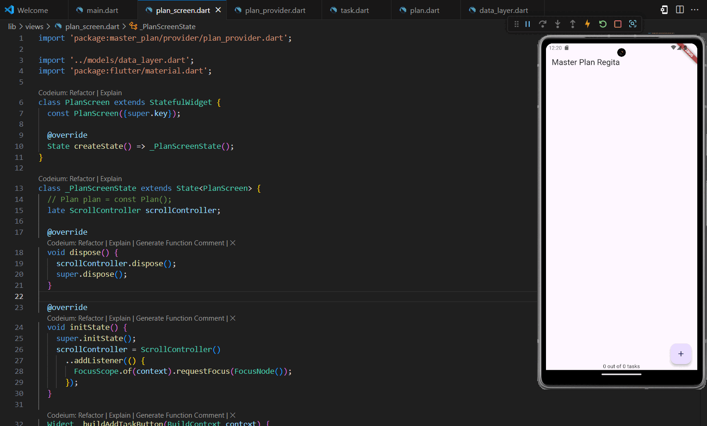

### Nama    : Regita Delya Putri
### Absen   : 21
### NIM     : 2241720137
### Kelas   : TI 3F
### Pertemuan: 10 (Dasar State Management)
---

# Tugas Praktikum 1: Dasar State dengan Model-View

## 1. Selesaikan langkah-langkah praktikum tersebut, lalu dokumentasikan berupa GIF hasil akhir praktikum beserta penjelasannya di file README.md! Jika Anda menemukan ada yang error atau tidak berjalan dengan baik, silakan diperbaiki.

## 2. Jelaskan maksud dari langkah 4 pada praktikum tersebut! Mengapa dilakukan demikian?

### Jawaban:

Membuat file data_layer.dart untuk mengatur export model seperti plan.dart dan task.dart mempermudah proses pengembangan dan pemeliharaan aplikasi. Dengan mengimpor model melalui satu file, kita bisa merapikan kode dan mengurangi jumlah pernyataan impor yang berulang di seluruh proyek. Selain itu, langkah ini membantu aplikasi lebih mudah discale, karena jika ada perubahan atau penambahan model, cukup memperbarui export di satu tempat tanpa mengubah banyak file lain. Praktik ini menjaga struktur proyek tetap terorganisir dan mempermudah pemeliharaan kode seiring berkembangnya aplikasi.

## 3. Mengapa perlu variabel plan di langkah 6 pada praktikum tersebut? Mengapa dibuat konstanta ?

### Jawaban:

Variabel plan diperlukan di langkah ini karena akan jadi tempat untuk menyimpan daftar rencana atau tugas yang ditampilkan di aplikasi. Dengan adanya variabel plan di kelas _PlanScreenState, kita bisa dengan mudah mengakses dan memanipulasi data rencana tersebut.

Variabel ini dibuat sebagai konstanta (const Plan()) karena data awal Plan di sini bersifat tetap atau belum perlu diubah. Jadi, const digunakan supaya objek ini tetap dan tidak berubah-ubah saat pertama kali dibuat. Namun, kalau nanti datanya perlu diubah (misalnya saat kita menambahkan tugas baru ke daftar), kita bisa menghapus const agar objeknya menjadi dinamis dan bisa di-update di dalam aplikasi.

## 4. Lakukan capture hasil dari Langkah 9 berupa GIF, kemudian jelaskan apa yang telah Anda buat!
### Jawaban:

Kita disini membuat aplikasi planning yang dapat mencatat segala kebutuhan dari usernya, ketika kebutuhan atau tugas tersebut telah diselesaikan user dapat mencentang tugasnya.

Output:

## 5. Apa kegunaan method pada Langkah 11 dan 13 dalam lifecyle state ?

### Jawaban:

initState() (Langkah 11): Method ini dipanggil sekali ketika widget pertama kali dibuat, dan digunakan untuk inisialisasi. Di sini, ScrollController dibuat dan listener ditambahkan agar aplikasi bisa mendeteksi saat pengguna menggulir layar. Dalam contoh ini, listener tersebut akan meminta fokus (dengan FocusScope.of(context).requestFocus(FocusNode())) setiap kali pengguna menggulir, yang berguna untuk menutup keyboard ketika layar digulir. Hal ini membantu menjaga tampilan tetap rapi dan mengurangi gangguan visual.

dispose() (Langkah 13): Method ini dipanggil saat widget sudah tidak digunakan dan akan dihapus dari widget tree. Dalam kasus ini, dispose() berfungsi untuk membersihkan ScrollController yang tidak lagi diperlukan dengan memanggil scrollController.dispose(). Ini penting untuk mencegah kebocoran memori (memory leak), karena ScrollController yang tidak dibersihkan dapat tetap tersimpan di memori walaupun widget sudah dihapus.

## 6. Kumpulkan laporan praktikum Anda berupa link commit atau repository GitHub ke dosen yang telah disepakati !

# Tugas Praktikum 2: InheritedWidget

## 1. Selesaikan langkah-langkah praktikum tersebut, lalu dokumentasikan berupa GIF hasil akhir praktikum beserta penjelasannya di file README.md! Jika Anda menemukan ada yang error atau tidak berjalan dengan baik, silakan diperbaiki sesuai dengan tujuan aplikasi tersebut dibuat.

## 2. Jelaskan mana yang dimaksud InheritedWidget pada langkah 1 tersebut! Mengapa yang digunakan InheritedNotifier?

### Jawaban:

Pada kode di atas, PlanProvider adalah sebuah InheritedNotifier, yaitu jenis khusus dari InheritedWidget yang digabungkan dengan ChangeNotifier. InheritedWidget digunakan untuk membagikan data secara efisien di seluruh widget tree tanpa harus melewatkan data tersebut secara eksplisit melalui setiap widget. PlanProvider memungkinkan data ValueNotifier<Plan> yang dibungkus di dalamnya dapat diakses oleh widget lain dalam tree, menggunakan fungsi of. Fungsi of ini memanfaatkan dependOnInheritedWidgetOfExactType untuk menemukan PlanProvider dalam widget tree, sehingga widget yang berada dalam cakupan PlanProvider dapat dengan mudah mengakses dan mendengarkan perubahan pada data Plan.

Penggunaan InheritedNotifier sangat tepat dalam kasus ini karena mendukung pembaruan data yang efisien. Ketika data Plan berubah, InheritedNotifier akan secara otomatis memperbarui hanya widget yang menggunakan data tersebut, tanpa harus membangun ulang seluruh widget tree. Ini meningkatkan performa aplikasi, karena pembaruan hanya terjadi pada bagian yang relevan. Selain itu, dengan adanya ValueNotifier<Plan> yang langsung diteruskan melalui InheritedNotifier, data tetap sinkron di seluruh widget yang membutuhkannya, menjadikan pengelolaan status aplikasi menjadi lebih responsif dan sederhana.

## 3. Jelaskan maksud dari method di langkah 3 pada praktikum tersebut! Mengapa dilakukan demikian?

### Jawaban:

Method get completedCount dan get completenessMessage digunakan untuk menghitung jumlah tugas yang telah selesai dan menampilkan pesan kemajuan tugas secara dinamis. completedCount menghitung jumlah tugas yang selesai dengan memfilter daftar tasks menggunakan where untuk mencari tugas yang memiliki nilai complete bernilai true, lalu menghitung hasilnya menggunakan length. Sementara itu, completenessMessage membentuk pesan kemajuan dalam format "$completedCount out of ${tasks.length} tasks", menampilkan jumlah tugas yang telah diselesaikan dari total seluruh tugas. Pendekatan ini memungkinkan tampilan progres yang otomatis terupdate ketika data tugas berubah, memudahkan pengguna untuk memantau kemajuan tanpa memerlukan penghitungan atau penyimpanan tambahan, sehingga mendukung desain aplikasi yang lebih responsif dan terstruktur.

## 4. Lakukan capture hasil dari Langkah 9 berupa GIF, kemudian jelaskan apa yang telah Anda buat!

### Jawaban:

Output:

## 5. Kumpulkan laporan praktikum Anda berupa link commit atau repository GitHub ke dosen yang telah disepakati !

# Praktikum 3: Membuat State di Multiple Screens

