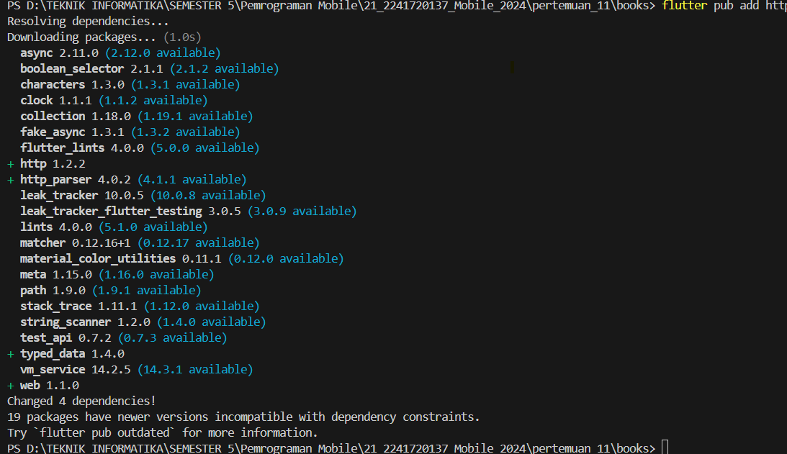
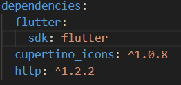
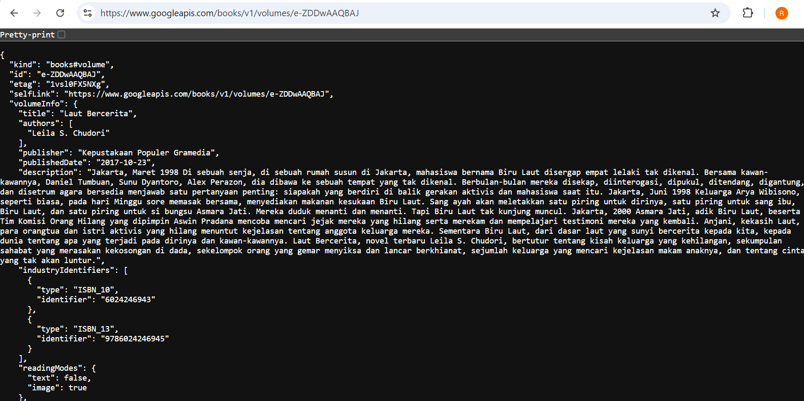
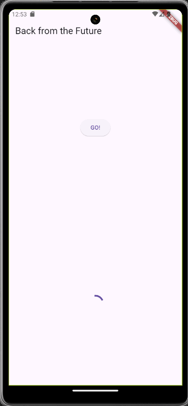
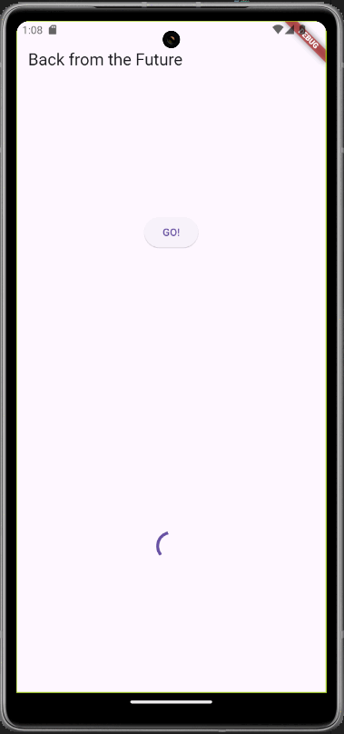
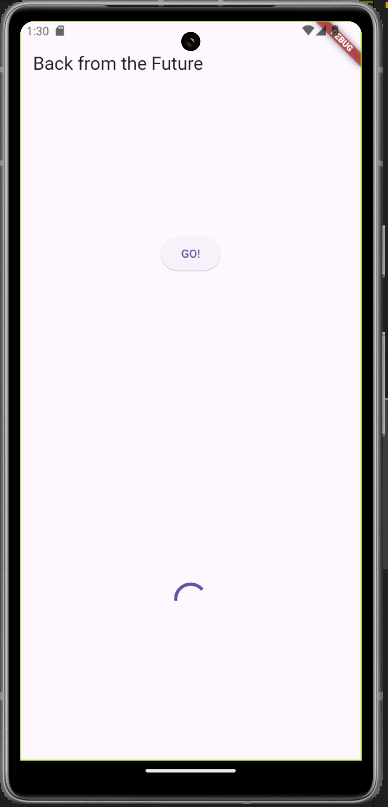
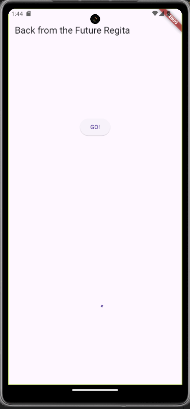

### Nama : Regita Delya Putri

### Absen : 21

### NIM : 2241720137

### Kelas : TI 3F

### Pertemuan: 11 (Pemrograman Asynchronous)

---

# Praktikum 1: Mengunduh Data dari Web Service (API)

## Langkah 1: Buat Project Baru

Output:



## Langkah 2: Cek file pubspec.yaml

Output:



## Langkah 3: Buka file main.dart

**Soal 1**

Tambahkan nama panggilan Anda pada title app sebagai identitas hasil pekerjaan Anda.

```
import 'dart:async';
import 'package:flutter/material.dart';
import 'package:http/http.dart';
import 'package:http/http.dart' as http;

void main() {
  runApp(const MyApp());
}

class MyApp extends StatelessWidget {
  const MyApp({super.key});

  // This widget is the root of your application.
  @override
  Widget build(BuildContext context) {
    return MaterialApp(
      title: 'Regita',
      theme: ThemeData(
        // This is the theme of your application.
        //
        // TRY THIS: Try running your application with "flutter run". You'll see
        // the application has a purple toolbar. Then, without quitting the app,
        // try changing the seedColor in the colorScheme below to Colors.green
        // and then invoke "hot reload" (save your changes or press the "hot
        // reload" button in a Flutter-supported IDE, or press "r" if you used
        // the command line to start the app).
        //
        // Notice that the counter didn't reset back to zero; the application
        // state is not lost during the reload. To reset the state, use hot
        // restart instead.
        //
        // This works for code too, not just values: Most code changes can be
        // tested with just a hot reload.
        primarySwatch: Colors.blue,
        visualDensity: VisualDensity.adaptivePlatformDensity,
      ),
      home: const FuturePage(),
    );
  }
}

class FuturePage extends StatefulWidget {
  const FuturePage({super.key});

  @override
  State<FuturePage> createState() => _FuturePageState();
}

class _FuturePageState extends State<FuturePage> {
  String result = '';

  @override
  Widget build(BuildContext context) {
    return Scaffold(
      appBar: AppBar(
        title: const Text('Back from the Future'),
      ),
      body: Center(
        child: Column(children: [
          const Spacer(),
          ElevatedButton(
            child: const Text('GO!'),
            onPressed: () {},
            ),
            const Spacer(),
            Text(result),
            const Spacer(),
            const CircularProgressIndicator(),
            const Spacer(),
        ]),
      ),
    );
  }
}
```

## Langkah 4: Tambah method getData()

```
  Future<Response> getData() async {
    const authority = 'www.gooleapis.com';
    const path = '/books/v1/volumes/junbDwAAQBAJ';
    Uri url = Uri.https(authority, path);
    return http.get(url);
  }
```

**Soal 2**

- Carilah judul buku favorit Anda di Google Books, lalu ganti ID buku pada variabel path di kode tersebut. (Laut Bercerita)

Output:


- Kemudian cobalah akses di browser URI tersebut dengan lengkap seperti ini. Jika menampilkan data JSON, maka Anda telah berhasil. Lakukan capture milik Anda dan tulis di README pada laporan praktikum. Lalu lakukan commit dengan pesan "W11: Soal 2".`

Output:



## Langkah 5: Tambah kode di ElevatedButton

```
ElevatedButton(
    child: const Text('GO!'),
    onPressed: () {
        setState(() {});
        getData().then((value) {
            result = value.body.toString().substring(0, 450);
            setState(() {});
            }).catchError((_) {
            result = 'An error occurred';
            setState(() {});
            });
        },
),
```

**Soal 3**

- Jelaskan maksud kode langkah 5 tersebut terkait substring dan catchError!

Jawaban:

Kode tersebut menggunakan `substring` untuk membatasi jumlah karakter dari respons API (`value.body`) hingga 450 karakter pertama agar tidak menampilkan teks terlalu panjang, namun ini berisiko memicu error jika panjang teks kurang dari 450, sehingga memerlukan pengecekan panjang terlebih dahulu. Selain itu, `catchError` digunakan untuk menangani error yang terjadi selama proses pengambilan data, seperti masalah jaringan atau kesalahan respons API, dengan mengubah nilai `result` menjadi pesan error (`'An error occurred'`) agar aplikasi tetap berjalan dan memberi tahu pengguna tentang kegagalan tersebut.

- Capture hasil praktikum Anda berupa GIF dan lampirkan di README. Lalu lakukan commit dengan pesan "W11: Soal 3".

Output:



# Praktikum 2: Menggunakan await/async untuk menghindari callbacks

## Langkah 1: Buka file main.dart

```
Future<int> returnOneAsync() async {
  await Future.delayed(const Duration(seconds: 3));
  return 1;
}

Future<int> returnTwoAsync() async {
  await Future.delayed(const Duration(seconds: 3));
  return 2;
}

Future<int> returnThreeAsync() async {
  await Future.delayed(const Duration(seconds: 3));
  return 3;
}
```

## Langkah 2: Tambah method count()

```
  Future count() async {
    int total = 0;
    total = await returnOneAsync();
    total += await returnTwoAsync();
    total += await returnThreeAsync();
    setState(() {
      result = total.toString();
    });
  }
```

## Langkah 3: Panggil count()

```
ElevatedButton(
    child: const Text('GO!'),
    onPressed: () {
        // setState(() {});
        // getData().then((value) {
        //   result = value.body.toString().substring(0, 450);
        //   setState(() {});
        // }).catchError((_) {
        //   result = 'An error occurred';
        //   setState(() {});
        // });
        count();
    },
),
```

## Langkah 4: Run

**Soal 4**
- Jelaskan maksud kode langkah 1 dan 2 tersebut!

Jawaban:

Langkah 1 mendefinisikan tiga fungsi asynchronous: returnOneAsync, returnTwoAsync, dan returnThreeAsync. Masing-masing fungsi ini mensimulasikan tugas yang memerlukan waktu pemrosesan dengan menunggu selama 3 detik menggunakan Future.delayed. Setelah waktu tunggu selesai, setiap fungsi mengembalikan nilai 1, 2, atau 3. Fungsi-fungsi ini biasanya digunakan untuk mensimulasikan operasi seperti pengambilan data dari server atau pemrosesan yang membutuhkan waktu tertentu.

Langkah 2 memperkenalkan fungsi asynchronous count() yang menghitung total nilai dari ketiga fungsi sebelumnya secara berurutan. Fungsi ini menggunakan await untuk menunggu setiap fungsi selesai sebelum melanjutkan ke langkah berikutnya. Total nilai dari setiap fungsi ditambahkan ke variabel total. Setelah semua proses selesai (dalam total waktu 9 detik), setState() dipanggil untuk memperbarui UI dengan hasil perhitungan dalam variabel result. Proses ini memastikan bahwa hasil ditampilkan secara akurat di layar setelah semua tugas selesai dijalankan.

- Capture hasil praktikum Anda berupa GIF dan lampirkan di README. Lalu lakukan commit dengan pesan "W11: Soal 4".

Output:



# Praktikum 3: Menggunakan Completer di Future

## Langkah 1: Buka main.dart

~~~
import 'package:async/async.dart';
~~~

## Langkah 2: Tambahkan variabel dan method

~~~
late Completer completer;

Future getNumber() {
  completer = Completer<int>();
  calculate();
  return completer.future;
}

Future calculate() async {
  await Future.delayed(const Duration(seconds : 5));
  completer.complete(42);
}
~~~

## Langkah 3: Ganti isi kode onPressed()

```
getNumber().then((value) {
    setState(() {
        result = value.toString();
    });
});
```

## Langkah 4: Run

**Soal 5**

- Jelaskan maksud kode langkah 2 tersebut!

Jawaban:

Kode ini menggunakan Completer untuk menangani operasi asynchronous dan memberi hasil ke pihak yang menunggu setelah proses selesai. Fungsi getNumber() membuat objek Completer<int> dan memanggil fungsi calculate(), yang akan menunggu selama 5 detik (menggunakan Future.delayed) sebelum menyelesaikan tugasnya dengan mengisi Completer dengan nilai 42 melalui completer.complete(42). Fungsi getNumber() kemudian mengembalikan completer.future, yang akan menyelesaikan dengan nilai yang diberikan oleh completer.complete(). Ini memungkinkan kode untuk menangani hasil asynchronous dengan cara yang lebih terkontrol, memberikan nilai setelah delay dan memungkinkan pihak lain untuk menunggu hasilnya.
- Capture hasil praktikum Anda berupa GIF dan lampirkan di README. Lalu lakukan commit dengan pesan "W11: Soal 5".

Output:



## Langkah 5: Ganti method calculate()

```
  calculate() async {
    try {
      await new Future.delayed(const Duration(seconds: 5));
      completer.complete(42);
// throw Exception();
    } catch (_) {
      completer.completeError({});
    }
  }
```
## Langkah 6: Pindah ke onPressed()

```
getNumber().then((value) {
  setState(() {
    result = value.toString();
  });
}).catchError((e) {
  result = 'An error occurred';
});
```

**Soal 6**
- Jelaskan maksud perbedaan kode langkah 2 dengan langkah 5-6 tersebut!

Jawaban:

Pada Langkah 2, kode berfokus pada penanganan operasi asynchronous yang sederhana menggunakan Completer. Fungsi getNumber() membuat objek Completer<int>, kemudian memanggil calculate(). Fungsi calculate() menunggu selama 5 detik (menggunakan Future.delayed), lalu menyelesaikan operasi dengan completer.complete(42), yang memberi nilai 42 kepada objek Completer tersebut. Hasilnya bisa diakses melalui completer.future, yang mengembalikan hasil setelah penundaan. Jika tidak ada kesalahan, hasil ini diselesaikan dengan nilai yang ditentukan.

Pada Langkah 5, kode ditambahkan dengan penanganan kesalahan menggunakan blok try-catch. Jika terjadi kesalahan dalam calculate() (meskipun saat ini hanya ada throw Exception() yang dikomentari), maka completer.completeError() akan dipanggil untuk menyelesaikan operasi dengan error. Hal ini memungkinkan untuk menangani error secara eksplisit, dan ketika terjadi kesalahan, alih-alih mendapatkan hasil nilai, kita akan mendapatkan error yang bisa ditangani oleh catchError. Pada Langkah 6, pemanggilan getNumber() dipindahkan ke dalam fungsi onPressed(), dengan then untuk menangani hasil sukses (nilai yang diterima dari completer.future) dan catchError untuk menangani kasus kesalahan. Dalam hal ini, nilai atau kesalahan akan memperbarui UI menggunakan setState() sesuai dengan kondisi yang terjadi (sukses atau error).

- Capture hasil praktikum Anda berupa GIF dan lampirkan di README. Lalu lakukan commit dengan pesan "W11: Soal 6".

Output:


