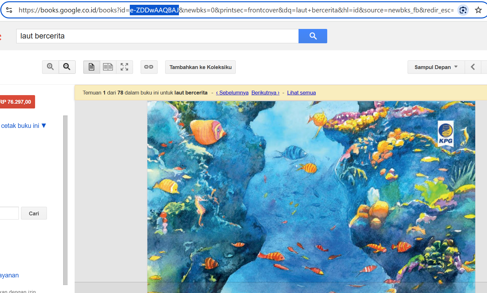
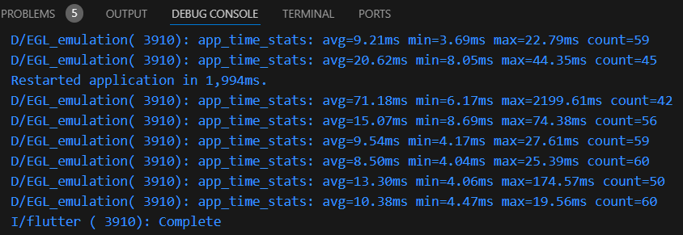

### Nama : Regita Delya Putri

### Absen : 21

### NIM : 2241720137

### Kelas : TI 3F

### Pertemuan: 11 (Pemrograman Asynchronous)

---

# Praktikum 1: Mengunduh Data dari Web Service (API)

## Langkah 1: Buat Project Baru

Output:


## Langkah 2: Cek file pubspec.yaml

Output:


## Langkah 3: Buka file main.dart

**Soal 1**

Tambahkan nama panggilan Anda pada title app sebagai identitas hasil pekerjaan Anda.

```
import 'dart:async';
import 'package:flutter/material.dart';
import 'package:http/http.dart';
import 'package:http/http.dart' as http;

void main() {
  runApp(const MyApp());
}

class MyApp extends StatelessWidget {
  const MyApp({super.key});

  // This widget is the root of your application.
  @override
  Widget build(BuildContext context) {
    return MaterialApp(
      title: 'Regita',
      theme: ThemeData(
        // This is the theme of your application.
        //
        // TRY THIS: Try running your application with "flutter run". You'll see
        // the application has a purple toolbar. Then, without quitting the app,
        // try changing the seedColor in the colorScheme below to Colors.green
        // and then invoke "hot reload" (save your changes or press the "hot
        // reload" button in a Flutter-supported IDE, or press "r" if you used
        // the command line to start the app).
        //
        // Notice that the counter didn't reset back to zero; the application
        // state is not lost during the reload. To reset the state, use hot
        // restart instead.
        //
        // This works for code too, not just values: Most code changes can be
        // tested with just a hot reload.
        primarySwatch: Colors.blue,
        visualDensity: VisualDensity.adaptivePlatformDensity,
      ),
      home: const FuturePage(),
    );
  }
}

class FuturePage extends StatefulWidget {
  const FuturePage({super.key});

  @override
  State<FuturePage> createState() => _FuturePageState();
}

class _FuturePageState extends State<FuturePage> {
  String result = '';

  @override
  Widget build(BuildContext context) {
    return Scaffold(
      appBar: AppBar(
        title: const Text('Back from the Future'),
      ),
      body: Center(
        child: Column(children: [
          const Spacer(),
          ElevatedButton(
            child: const Text('GO!'),
            onPressed: () {},
            ),
            const Spacer(),
            Text(result),
            const Spacer(),
            const CircularProgressIndicator(),
            const Spacer(),
        ]),
      ),
    );
  }
}
```

## Langkah 4: Tambah method getData()

```
  Future<Response> getData() async {
    const authority = 'www.gooleapis.com';
    const path = '/books/v1/volumes/junbDwAAQBAJ';
    Uri url = Uri.https(authority, path);
    return http.get(url);
  }
```

**Soal 2**

- Carilah judul buku favorit Anda di Google Books, lalu ganti ID buku pada variabel path di kode tersebut. (Laut Bercerita)

Output:



- Kemudian cobalah akses di browser URI tersebut dengan lengkap seperti ini. Jika menampilkan data JSON, maka Anda telah berhasil. Lakukan capture milik Anda dan tulis di README pada laporan praktikum. Lalu lakukan commit dengan pesan "W11: Soal 2".`

Output:


## Langkah 5: Tambah kode di ElevatedButton

```
ElevatedButton(
    child: const Text('GO!'),
    onPressed: () {
        setState(() {});
        getData().then((value) {
            result = value.body.toString().substring(0, 450);
            setState(() {});
            }).catchError((_) {
            result = 'An error occurred';
            setState(() {});
            });
        },
),
```

**Soal 3**

- Jelaskan maksud kode langkah 5 tersebut terkait substring dan catchError!

Jawaban:

Kode tersebut menggunakan `substring` untuk membatasi jumlah karakter dari respons API (`value.body`) hingga 450 karakter pertama agar tidak menampilkan teks terlalu panjang, namun ini berisiko memicu error jika panjang teks kurang dari 450, sehingga memerlukan pengecekan panjang terlebih dahulu. Selain itu, `catchError` digunakan untuk menangani error yang terjadi selama proses pengambilan data, seperti masalah jaringan atau kesalahan respons API, dengan mengubah nilai `result` menjadi pesan error (`'An error occurred'`) agar aplikasi tetap berjalan dan memberi tahu pengguna tentang kegagalan tersebut.

- Capture hasil praktikum Anda berupa GIF dan lampirkan di README. Lalu lakukan commit dengan pesan "W11: Soal 3".

Output:


# Praktikum 2: Menggunakan await/async untuk menghindari callbacks

## Langkah 1: Buka file main.dart

```
Future<int> returnOneAsync() async {
  await Future.delayed(const Duration(seconds: 3));
  return 1;
}

Future<int> returnTwoAsync() async {
  await Future.delayed(const Duration(seconds: 3));
  return 2;
}

Future<int> returnThreeAsync() async {
  await Future.delayed(const Duration(seconds: 3));
  return 3;
}
```

## Langkah 2: Tambah method count()

```
  Future count() async {
    int total = 0;
    total = await returnOneAsync();
    total += await returnTwoAsync();
    total += await returnThreeAsync();
    setState(() {
      result = total.toString();
    });
  }
```

## Langkah 3: Panggil count()

```
ElevatedButton(
    child: const Text('GO!'),
    onPressed: () {
        // setState(() {});
        // getData().then((value) {
        //   result = value.body.toString().substring(0, 450);
        //   setState(() {});
        // }).catchError((_) {
        //   result = 'An error occurred';
        //   setState(() {});
        // });
        count();
    },
),
```

## Langkah 4: Run

**Soal 4**
- Jelaskan maksud kode langkah 1 dan 2 tersebut!

Jawaban:

Langkah 1 mendefinisikan tiga fungsi asynchronous: returnOneAsync, returnTwoAsync, dan returnThreeAsync. Masing-masing fungsi ini mensimulasikan tugas yang memerlukan waktu pemrosesan dengan menunggu selama 3 detik menggunakan Future.delayed. Setelah waktu tunggu selesai, setiap fungsi mengembalikan nilai 1, 2, atau 3. Fungsi-fungsi ini biasanya digunakan untuk mensimulasikan operasi seperti pengambilan data dari server atau pemrosesan yang membutuhkan waktu tertentu.

Langkah 2 memperkenalkan fungsi asynchronous count() yang menghitung total nilai dari ketiga fungsi sebelumnya secara berurutan. Fungsi ini menggunakan await untuk menunggu setiap fungsi selesai sebelum melanjutkan ke langkah berikutnya. Total nilai dari setiap fungsi ditambahkan ke variabel total. Setelah semua proses selesai (dalam total waktu 9 detik), setState() dipanggil untuk memperbarui UI dengan hasil perhitungan dalam variabel result. Proses ini memastikan bahwa hasil ditampilkan secara akurat di layar setelah semua tugas selesai dijalankan.

- Capture hasil praktikum Anda berupa GIF dan lampirkan di README. Lalu lakukan commit dengan pesan "W11: Soal 4".

Output:


# Praktikum 3: Menggunakan Completer di Future

## Langkah 1: Buka main.dart

~~~
import 'package:async/async.dart';
~~~

## Langkah 2: Tambahkan variabel dan method

~~~
late Completer completer;

Future getNumber() {
  completer = Completer<int>();
  calculate();
  return completer.future;
}

Future calculate() async {
  await Future.delayed(const Duration(seconds : 5));
  completer.complete(42);
}
~~~

## Langkah 3: Ganti isi kode onPressed()

```
getNumber().then((value) {
    setState(() {
        result = value.toString();
    });
});
```

## Langkah 4: Run

**Soal 5**

- Jelaskan maksud kode langkah 2 tersebut!

Jawaban:

Kode ini menggunakan Completer untuk menangani operasi asynchronous dan memberi hasil ke pihak yang menunggu setelah proses selesai. Fungsi getNumber() membuat objek Completer<int> dan memanggil fungsi calculate(), yang akan menunggu selama 5 detik (menggunakan Future.delayed) sebelum menyelesaikan tugasnya dengan mengisi Completer dengan nilai 42 melalui completer.complete(42). Fungsi getNumber() kemudian mengembalikan completer.future, yang akan menyelesaikan dengan nilai yang diberikan oleh completer.complete(). Ini memungkinkan kode untuk menangani hasil asynchronous dengan cara yang lebih terkontrol, memberikan nilai setelah delay dan memungkinkan pihak lain untuk menunggu hasilnya.
- Capture hasil praktikum Anda berupa GIF dan lampirkan di README. Lalu lakukan commit dengan pesan "W11: Soal 5".

Output:


## Langkah 5: Ganti method calculate()

```
  calculate() async {
    try {
      await new Future.delayed(const Duration(seconds: 5));
      completer.complete(42);
// throw Exception();
    } catch (_) {
      completer.completeError({});
    }
  }
```
## Langkah 6: Pindah ke onPressed()

```
getNumber().then((value) {
  setState(() {
    result = value.toString();
  });
}).catchError((e) {
  result = 'An error occurred';
});
```

**Soal 6**
- Jelaskan maksud perbedaan kode langkah 2 dengan langkah 5-6 tersebut!

Jawaban:

Pada Langkah 2, kode berfokus pada penanganan operasi asynchronous yang sederhana menggunakan Completer. Fungsi getNumber() membuat objek Completer<int>, kemudian memanggil calculate(). Fungsi calculate() menunggu selama 5 detik (menggunakan Future.delayed), lalu menyelesaikan operasi dengan completer.complete(42), yang memberi nilai 42 kepada objek Completer tersebut. Hasilnya bisa diakses melalui completer.future, yang mengembalikan hasil setelah penundaan. Jika tidak ada kesalahan, hasil ini diselesaikan dengan nilai yang ditentukan.

Pada Langkah 5, kode ditambahkan dengan penanganan kesalahan menggunakan blok try-catch. Jika terjadi kesalahan dalam calculate() (meskipun saat ini hanya ada throw Exception() yang dikomentari), maka completer.completeError() akan dipanggil untuk menyelesaikan operasi dengan error. Hal ini memungkinkan untuk menangani error secara eksplisit, dan ketika terjadi kesalahan, alih-alih mendapatkan hasil nilai, kita akan mendapatkan error yang bisa ditangani oleh catchError. Pada Langkah 6, pemanggilan getNumber() dipindahkan ke dalam fungsi onPressed(), dengan then untuk menangani hasil sukses (nilai yang diterima dari completer.future) dan catchError untuk menangani kasus kesalahan. Dalam hal ini, nilai atau kesalahan akan memperbarui UI menggunakan setState() sesuai dengan kondisi yang terjadi (sukses atau error).

- Capture hasil praktikum Anda berupa GIF dan lampirkan di README. Lalu lakukan commit dengan pesan "W11: Soal 6".

Output:


# Praktikum 4: Memanggil Future secara paralel

## Langkah 1: Buka file main.dart

```
void returnFG() {
    FutureGroup<int> futureGroup = FutureGroup<int>();
    futureGroup.add(returnOneAsync());
    futureGroup.add(returnTwoAsync());
    futureGroup.add(returnThreeAsync());
    futureGroup.close();
    futureGroup.future.then((List<int> value) {
      int total = 0;
      for (var element in value) {
        total += element;
      }
      setState(() {
        result = total.toString();
      });
    });
  }
```

## Langkah 2: Edit onPressed()

```
onPressed: () {
    returnFG();
},
```

## Langkah 3: Run
Anda akan melihat hasilnya dalam 3 detik berupa angka 6 lebih cepat dibandingkan praktikum sebelumnya menunggu sampai 9 detik.

**Soal 7**

- Capture hasil praktikum Anda berupa GIF dan lampirkan di README. Lalu lakukan commit dengan pesan "W11: Soal 7".

Output:


## Langkah 4: Ganti variabel futureGroup

```
void returnFG() {
    final futures = Future.wait<int>([
      returnOneAsync(),
      returnTwoAsync(),
      returnThreeAsync(),
    ]);
    futures.then((List<int> value) {
      int total = 0;
      for (var element in value) {
        total += element;
      }
      setState(() {
        result = total.toString();
      });
    });
  }
```

**Soal 8**

- Jelaskan maksud perbedaan kode langkah 1 dan 4!

Jawaban:

Kode 1 - Menggunakan FutureGroup
Pada kode ini, objek FutureGroup<int> digunakan untuk mengelompokkan beberapa operasi asynchronous, dalam hal ini returnOneAsync(), returnTwoAsync(), dan returnThreeAsync(). Masing-masing Future ditambahkan ke futureGroup menggunakan metode add(). Setelah semua operasi ditambahkan, futureGroup.close() dipanggil untuk menandakan bahwa tidak ada Future tambahan yang akan ditambahkan ke grup. Kemudian, futureGroup.future digunakan untuk mendapatkan hasil setelah semua operasi selesai, dan ketika selesai, hasilnya dikumpulkan dalam sebuah list (List<int>). Proses pengumpulan hasil dilakukan dengan cara menjumlahkan nilai dalam list tersebut dan mengupdate UI melalui setState().

Kode 4 - Menggunakan Future.wait
Pada kode ini, Future.wait() digunakan untuk menjalankan beberapa Future secara paralel dan menunggu semuanya selesai sebelum melanjutkan. Fungsi Future.wait() menerima sebuah list yang berisi beberapa Future (dalam hal ini hasil dari returnOneAsync(), returnTwoAsync(), dan returnThreeAsync()) dan mengembalikan sebuah Future<List<int>> yang berisi hasil dari semua operasi tersebut dalam urutan yang sama. Tidak ada kebutuhan untuk menambahkan Future satu per satu seperti di kode pertama, dan setelah semua operasi selesai, hasilnya langsung tersedia sebagai list yang bisa langsung diproses.

# Praktikum 5: Menangani Respon Error pada Async Code

## Langkah 1: Buka file main.dart

```
  Future returnError() async {
    await Future.delayed(const Duration(seconds: 2));
    throw Exception('Something terrible happened!');
  }
```

## Langkah 2: ElevatedButton

```
returnError()
    .then((value) {
        setState(() {
            result = 'Success';
        });
    }).catchError((onError) {
        setState(() {
            result = onError.toString();
        });
    }).whenComplete(() => print('Complete'));
```

## Langkah 3: Run

Output:


Pada bagian debug console akan melihat teks Complete seperti berikut.

Output:



**Soal 9**
- Capture hasil praktikum Anda berupa GIF dan lampirkan di README. Lalu lakukan commit dengan pesan "W11: Soal 9".

Output:


## Langkah 4: Tambah method handleError()

```
  Future handleError() async {
    try {
      await returnError();
    } catch (error) {
      setState(() {
        result = error.toString();
      });
    } finally {
      print('Complete');
    }
  }
```

**Soal 10**
- Panggil method handleError() tersebut di ElevatedButton, lalu run. Apa hasilnya? Jelaskan perbedaan kode langkah 1 dan 4!

```
onPressed: () {
    handleError();
},
```
Output:


Perbedaan kode langkah 1 dan 4:

Langkah 1 (FutureGroup): Menggunakan FutureGroup untuk menambahkan beberapa futures dan menunggu semua futures selesai secara paralel. Setelah semuanya selesai, hasilnya digabungkan dan diproses.

Langkah 4 (Future.wait): Menggunakan Future.wait untuk menunggu beberapa futures selesai secara paralel dan mengembalikan hasilnya dalam bentuk list. Lebih sederhana dan umum digunakan daripada FutureGroup.

# Praktikum 6: Menggunakan Future dengan StatefulWidget

## Langkah 1: install plugin geolocator

Output:


## Langkah 2: Tambah permission GPS
 
Output:


## Langkah 3: Buat file geolocation.dart
 
Output:


## Langkah 4: Buat StatefulWidget
Tambahkan file baru ini di folder lib project Anda.

## Langkah 5: Isi kode geolocation.dart

```
import 'package:flutter/material.dart';
import 'package:geolocator/geolocator.dart';

class LocationScreen extends StatefulWidget {
  const LocationScreen({super.key});

  @override
  State<LocationScreen> createState() => _LocationScreenState();
}

class _LocationScreenState extends State<LocationScreen> {
  String myPosition = '';

  @override
  void initState() {
    super.initState();
    getPosition().then((Position myPos) {
      myPosition =
          'Latitude: ${myPos.latitude.toString()} - Longitude:{myPos.longitude. toString()}';
      setState(() {
        myPosition = myPosition;
      });
    });
  }

  @override
  Widget build(BuildContext context) {
    return Scaffold(
      appBar: AppBar(title: const Text('Current Location')),
      body: Center(child: Text(myPosition)),
    );
  }

  Future<Position> getPosition() async {
    await Geolocator.requestPermission();
    await Geolocator.isLocationServiceEnabled();
    Position? position = await Geolocator.getCurrentPosition();
    return position;
  }
}
```

**Soal 11**
- Tambahkan nama panggilan Anda pada tiap properti title sebagai identitas pekerjaan Anda.

## Langkah 6: Edit main.dart
Panggil screen baru tersebut di file main Anda seperti berikut.

```
home: LocationScreen(),
```

## Langkah 7: Run

Run project Anda di device atau emulator (bukan browser), maka akan tampil seperti berikut ini.

Output:


## Langkah 8: Tambahkan animasi loading

```
  @override
  Widget build(BuildContext context) {
    final myWidget = myPosition == ''
      ? const CircularProgressIndicator()
      : Text(myPosition);

    return Scaffold(
      appBar: AppBar(title: const Text('Current Location Regita')),
      body: Center(child: myWidget),
    );
  }
```

**Soal 12**
- Jika Anda tidak melihat animasi loading tampil, kemungkinan itu berjalan sangat cepat. Tambahkan delay pada method getPosition() dengan kode await Future.delayed(const Duration(seconds: 3));
- Apakah Anda mendapatkan koordinat GPS ketika run di browser? Mengapa demikian?

Jawaban:

Tidak, tidak bisa mendapatkan koordinat GPS ketika menjalankan aplikasi Flutter di browser karena browser tidak memiliki akses langsung ke sensor GPS perangkat seperti halnya aplikasi native di perangkat Android atau iOS.

- Capture hasil praktikum Anda berupa GIF dan lampirkan di README. Lalu lakukan commit dengan pesan "W11: Soal 12".

Output:


# Praktikum 7: Manajemen Future dengan FutureBuilder

## Langkah 1: Modifikasi method getPosition()
```
  Future<Position> getPosition() async {
    await Geolocator.requestPermission();
    await Future.delayed(const Duration(seconds: 3));
    // await Geolocator.isLocationServiceEnabled();
    Position? position = await Geolocator.getCurrentPosition();
    return position;
  }
```

## Langkah 2: Tambah variabel
```
class _LocationScreenState extends State<LocationScreen> {
  String myPosition = '';
  Future<Position>? position;
```

## Langkah 3: Tambah initState()
```
 void initState() {
    super.initState();
    position = getPosition();
```

## Langkah 4: Edit method build()
```
  @override
  Widget build(BuildContext context) {
    return Scaffold(
        appBar: AppBar(title: Text('Current Location Regita')),
        body: Center(
          child: FutureBuilder(
            future: position,
            builder: (BuildContext context, AsyncSnapshot<Position> snapshot) {
              if (snapshot.connectionState == ConnectionState.waiting) {
                return const CircularProgressIndicator();
              } else if (snapshot.connectionState == ConnectionState.done) {
                return Text(snapshot.data.toString());
              } else {
                return const Text('');
              }
            },
          ),
        ));
  }
```

**Soal 13**
- Apakah ada perbedaan UI dengan praktikum sebelumnya? Mengapa demikian?

Jawaban: Iya

- Capture hasil praktikum Anda berupa GIF dan lampirkan di README. Lalu lakukan commit dengan pesan "W11: Soal 13".

Output:


- Seperti yang Anda lihat, menggunakan FutureBuilder lebih efisien, clean, dan reactive dengan Future bersama UI.

## Langkah 5: Tambah handling error

```
else if (snapshot.connectionState == ConnectionState.done) {
  if (snapshot.hasError) {
     return Text('Something terrible happened!');
  }
  return Text(snapshot.data.toString());
}
```

**Soal 14**
- Apakah ada perbedaan UI dengan langkah sebelumnya? Mengapa demikian?

Jawaban:

Langkah terbaru menambahkan fitur untuk menangani error dan memberi tahu pengguna jika sesuatu salah terjadi (misalnya, kesalahan saat mengambil lokasi). Tanpa penanganan error, aplikasi hanya akan menunggu atau menampilkan hasil kosong jika terjadi error. Dengan penanganan error, aplikasi memberikan feedback yang jelas kepada pengguna tentang masalah yang terjadi.

# Praktikum 8: Navigation route dengan Future Function

## Langkah 1: Buat file baru navigation_first.dart

Output:


## Langkah 2: Isi kode navigation_first.dart
```
import 'package:flutter/material.dart';

class NavigationFirst extends StatefulWidget {
  const NavigationFirst({super.key});

  @override
  State<NavigationFirst> createState() => _NavigationFirstState();
}

class _NavigationFirstState extends State<NavigationFirst> {
  Color color = const Color.fromARGB(255, 233, 102, 102);

  @override
  Widget build(BuildContext context) {
    return Scaffold(
      backgroundColor: color,
      appBar: AppBar(
        title: const Text('Navigation First Screen Regita'),
      ),
      body: Center(
        child: ElevatedButton(
          child: const Text('Change Color'),
          onPressed: () {
            _navigateAndGetColor(context);
          },
        ),
      ),
    );
  }
}
```

**Soal 15**
- Tambahkan nama panggilan Anda pada tiap properti title sebagai identitas pekerjaan Anda.
- Silakan ganti dengan warna tema favorit Anda.

## Langkah 3: Tambah method di class _NavigationFirstState
```
Future _navigateAndGetColor(BuildContext context) async {
   color = await Navigator.push(context,
        MaterialPageRoute(builder: (context) => const NavigationSecond()),) ?? Colors.blue;
   setState(() {});
   });
}
```
## Langkah 4: Buat file baru navigation_second.dart

Output:


## Langkah 5: Buat class NavigationSecond dengan StatefulWidget
```
import 'package:flutter/material.dart';

class NavigationSecond extends StatefulWidget {
  const NavigationSecond({super.key});

  @override
  State<NavigationSecond> createState() => _NavigationSecondState();
}

class _NavigationSecondState extends State<NavigationSecond> {
  @override
  Widget build(BuildContext context) {
    Color color;
    return Scaffold(
      appBar: AppBar(
        title: const Text('Navigation Second Screen Regita'),
      ),
      body: Center(
        child: Column(
          mainAxisAlignment: MainAxisAlignment.spaceEvenly,
          children: [
            ElevatedButton(
              child: const Text('Red'),
              onPressed: () {
                color = Colors.red.shade700;
                Navigator.pop(context, color);
              },
            ),
            ElevatedButton(
              child: const Text('Green'),
              onPressed: () {
                color = Colors.green.shade700;
                Navigator.pop(context, color);
              },
            ),
            ElevatedButton(
              child: const Text('Blue'),
              onPressed: () {
                color = Colors.blue.shade700;
                Navigator.pop(context, color);
              },
            ),
          ],
        ),
      ),
    );
  }
}
```

## Langkah 6: Edit main.dart
```
  home: NavigationFirst(),
```

## Langkah 7: Run

**Soal 16**
- Cobalah klik setiap button, apa yang terjadi ?

Output:


- Gantilah 3 warna pada langkah 5 dengan warna favorit Anda!

```
import 'package:flutter/material.dart';

class NavigationSecond extends StatefulWidget {
  const NavigationSecond({super.key});

  @override
  State<NavigationSecond> createState() => _NavigationSecondState();
}

class _NavigationSecondState extends State<NavigationSecond> {
  @override
  Widget build(BuildContext context) {
    Color color;
    return Scaffold(
      appBar: AppBar(
        title: const Text('Navigation Second Screen Regita'),
      ),
      body: Center(
        child: Column(
          mainAxisAlignment: MainAxisAlignment.spaceEvenly,
          children: [
            ElevatedButton(
              child: const Text('Yellow'),
              onPressed: () {
                color = Colors.yellow.shade700;
                Navigator.pop(context, color);
              },
            ),
            ElevatedButton(
              child: const Text('Pink'),
              onPressed: () {
                color = const Color.fromARGB(255, 219, 108, 164);
                Navigator.pop(context, color);
              },
            ),
            ElevatedButton(
              child: const Text('Purple'),
              onPressed: () {
                color = const Color.fromARGB(255, 167, 6, 199);
                Navigator.pop(context, color);
              },
            ),
          ],
        ),
      ),
    );
  }
}
```

Output:


- Capture hasil praktikum Anda berupa GIF dan lampirkan di README. Lalu lakukan commit dengan pesan "W11: Soal 16".

# Praktikum 9: Memanfaatkan async/await dengan Widget Dialog

## Langkah 1: Buat file baru navigation_dialog.dart

Output:


## Langkah 2: Isi kode navigation_dialog.dart 
```
import 'package:flutter/material.dart';

class NavigationDialogScreen extends StatefulWidget {
  const NavigationDialogScreen({super.key});

  @override
  State<NavigationDialogScreen> createState() => _NavigationDialogScreenState();
}

class _NavigationDialogScreenState extends State<NavigationDialogScreen> {
  Color color = Colors.blue.shade700;
  
  @override
  Widget build(BuildContext context) {
    return Scaffold(
      backgroundColor: color,
      appBar: AppBar(
        title: const Text('Navigation Dialog Screen'),
      ),
      body: Center(
        child: ElevatedButton(
          child: const Text('Change Color'),
          onPressed: () {},
        ),
      ),
    );
  }
}
```

## Langkah 3: Tambah method async
```
_showColorDialog(BuildContext context) async {
  await showDialog(
    barrierDismissible: false,
    context: context,
    builder: (_) {
      return AlertDialog(
        title: const Text('Very important question'),
        content: const Text('Please choose a color'),
        actions: <Widget>[
          TextButton(
            child: const Text('Red'),
            onPressed: () {
              color = Colors.red.shade700;
              Navigator.pop(context, color);
            },
          ),
          TextButton(
            child: const Text('Green'),
            onPressed: () {
              color = Colors.green.shade700;
              Navigator.pop(context, color);
            },
          ),
          TextButton(
            child: const Text('Blue'),
            onPressed: () {
              color = Colors.blue.shade700;
              Navigator.pop(context, color);
            },
          ),
        ],
      );
    },
  );
  setState(() {});
}
```

## Langkah 4: Panggil method di ElevatedButton
```
onPressed: () {
  _showColorDialog(context);
},
```

## Langkah 5: Edit main.dart
```
home: const NavigationDialogScreen(),
```

## Langkah 6: Run

**Soal 17**

- Cobalah klik setiap button, apa yang terjadi ? Mengapa demikian ?

Output:


- Gantilah 3 warna pada langkah 3 dengan warna favorit Anda!

```
_showColorDialog(BuildContext context) async {
    await showDialog(
      barrierDismissible: false,
      context: context,
      builder: (_) {
        return AlertDialog(
          title: const Text('Very important question'),
          content: const Text('Please choose a color'),
          actions: <Widget>[
            TextButton(
              child: const Text('Gray'),
              onPressed: () {
                color = const Color.fromARGB(255, 166, 156, 173);
                Navigator.pop(context, color);
              },
            ),
            TextButton(
              child: const Text('Pink'),
              onPressed: () {
                color = const Color.fromARGB(255, 196, 127, 199);
                Navigator.pop(context, color);
              },
            ),
            TextButton(
              child: const Text('Maroon'),
              onPressed: () {
                color = const Color.fromARGB(255, 141, 3, 3);
                Navigator.pop(context, color);
              },
            ),
          ],
        );
      },
    );
    setState(() {});
  }
```

Output:


- Capture hasil praktikum Anda berupa GIF dan lampirkan di README. Lalu lakukan commit dengan pesan "W11: Soal 17".