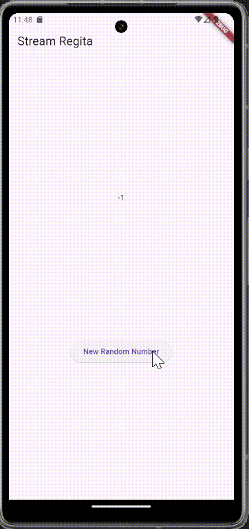
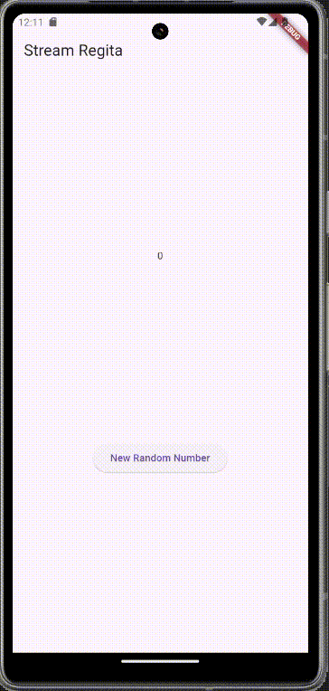
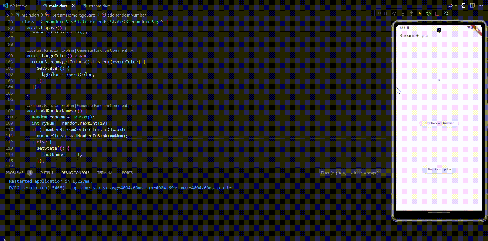
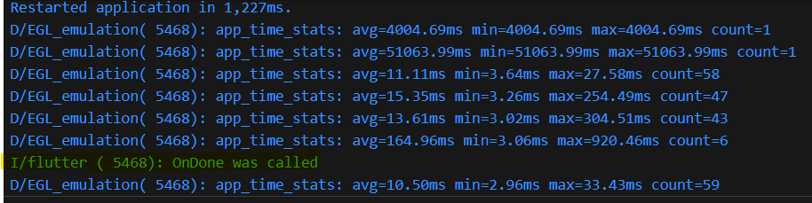
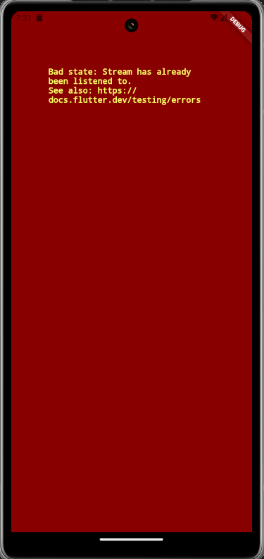
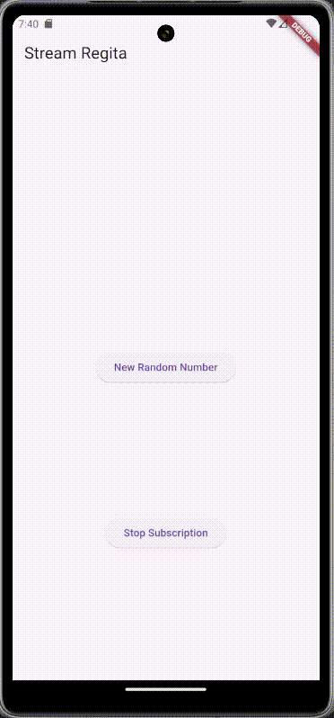

### Nama : Regita Delya Putri

### Absen : 21

### NIM : 2241720137

### Kelas : TI 3F

### Pertemuan: 12 (Streams)

---

# Praktikum 1: Dart Streams

## Langkah 1: Buat Project Baru

Output:


## Langkah 2: Buka file main.dart

```
import 'package:flutter/material.dart';

void main() {
  runApp(const MyApp());
}

class MyApp extends StatelessWidget {
  const MyApp({super.key});

  // This widget is the root of your application.
  @override
  Widget build(BuildContext context) {
    return MaterialApp(
      title: 'Stream Regita',
      theme: ThemeData(
        primarySwatch: Colors.deepPurple,
      ),
      home: const StreamHomePage(),
    );
  }
}

class StreamHomePage extends StatefulWidget {
  const StreamHomePage({super.key});

  @override
  State<StreamHomePage> createState() => _StreamHomePageState();
}

class _StreamHomePageState extends State<StreamHomePage> {
  @override
  Widget build(BuildContext context) {
    return Container();
  }
}
```

**Soal 1**
- Tambahkan nama panggilan Anda pada title app sebagai identitas hasil pekerjaan Anda.

`Jawaban:`

```
Widget build(BuildContext context) {
    return MaterialApp(
      title: 'Stream Regita', // Nama: Regita
      theme: ThemeData(
        primarySwatch: Colors.brown,
      ),
      home: const StreamHomePage(),
    );
  }
```

- Gantilah warna tema aplikasi sesuai kesukaan Anda.

`Jawaban:`

```
Widget build(BuildContext context) {
    return MaterialApp(
      title: 'Stream Regita',
      theme: ThemeData(
        primarySwatch: Colors.brown, Color: Brown
      ),
      home: const StreamHomePage(),
    );
  }
```

- Lakukan commit hasil jawaban Soal 1 dengan pesan "W12: Jawaban Soal 1"

## Langkah 3: Buat file baru stream.dart

Output:


## Langkah 4: Tambah variabel colors

```
class ColorStream {
  final List<Color> colors = [
    Colors.blueGrey,
    Colors.amber,
    Colors.deepPurple,
    Colors.lightBlue,
    Colors.teal
  ];
}
```

**Soal 2**
- Tambahkan 5 warna lainnya sesuai keinginan Anda pada variabel colors tersebut.

```
class ColorStream {
  final List<Color> colors = [
    Colors.blueGrey,
    Colors.amber,
    Colors.deepPurple,
    Colors.lightBlue,
    Colors.teal,
    Colors.indigo,
    Colors.redAccent,
    Colors.greenAccent,
    Colors.pink,
    Colors.lime
  ];
}
```

- Lakukan commit hasil jawaban Soal 2 dengan pesan "W12: Jawaban Soal 2"

## Langkah 5: Tambah method getColors()

```
Stream<Color> getColors() async* {
    
}
```

## Langkah 6: Tambah perintah yield*

```
  Stream<Color> getColors() async* {
    yield* Stream.periodic(const Duration(seconds: 1), (int t) {
      int index = t % colors.length;
      return colors[index];
    });
  }
```

**Soal 3**
- Jelaskan fungsi keyword yield* pada kode tersebut!

`Jawaban:`

Meneruskan seluruh elemen dari stream yang dihasilkan Stream.periodic ke dalam stream getColors.

- Apa maksud isi perintah kode tersebut?

`Jawaban:` 

Menghasilkan stream warna-warna dalam urutan siklik dari array colors setiap detik.

- Lakukan commit hasil jawaban Soal 3 dengan pesan "W12: Jawaban Soal 3"

## Langkah 7: Buka main.dart

Output:


## Langkah 8: Tambah variabel

```
class _StreamHomePageState extends State<StreamHomePage> {
  Color bgColor = Colors.blueGrey;
  late ColorStream colorStream;
```

## Langkah 9: Tambah method changeColor()

```
  void changeColor() async {
    await for (var eventColor in colorStream.getColors()) {
      setState(() {
        bgColor = eventColor;
      });
    }
  }
```

## Langkah 10: Lakukan override initState()

```
  @override
  void initState() {
    super.initState();
    colorStream = ColorStream();
    changeColor();
  }
```

## Langkah 11: Ubah isi Scaffold()

```
Widget build(BuildContext context) {
    return Scaffold(
      appBar: AppBar(
        title: const Text('Stream Regita'),
      ),
      body: Container(
        decoration: BoxDecoration(color: bgColor),
      ),
    );
  }
```

## Langkah 12: Run

**Soal 4**
- Capture hasil praktikum Anda berupa GIF dan lampirkan di README.

Output:


- Lakukan commit hasil jawaban Soal 4 dengan pesan "W12: Jawaban Soal 4"

## Langkah 13: Ganti isi method changeColor()

```
  void changeColor() async {
    colorStream.getColors().listen((eventColor) {
      setState(() {
        bgColor = eventColor;
      });
    });
  }
```

**Soal 5**

- Jelaskan perbedaan menggunakan listen dan await for (langkah 9) !

`Jawaban:`

Perbedaan antara listen dan await for terletak pada cara mereka mengonsumsi dan menangani stream dalam Dart. listen digunakan untuk berlangganan ke stream dan menangani setiap data yang diterima melalui callback. Dengan listen, kita dapat menangani berbagai event seperti data yang diterima, error yang terjadi, dan akhir dari stream menggunakan parameter onData, onError, dan onDone. Ini memberikan kontrol yang lebih besar terhadap aliran data dan memungkinkan pengelolaan lebih lanjut, tetapi memerlukan penanganan manual untuk setiap event yang mungkin terjadi.

Di sisi lain, await for digunakan dalam loop asinkron untuk secara langsung menunggu dan memproses setiap elemen yang dihasilkan oleh stream. Ini lebih sederhana dan lebih mudah dibaca, karena kita hanya perlu menunggu data yang diterima dan memprosesnya, tanpa perlu menangani callback secara eksplisit. Namun, await for lebih terbatas karena tidak dapat menangani error atau status lainnya seperti penutupan stream. Jika hanya membutuhkan pengolahan data secara berurutan tanpa perlu penanganan error atau status stream, await for adalah pilihan yang lebih ringkas.

- Lakukan commit hasil jawaban Soal 5 dengan pesan "W12: Jawaban Soal 5"


# Praktikum 2: Stream controllers dan sinks

## Langkah 1: Buka file stream.dart
Lakukan impor dengan mengetik kode ini.

```
import 'dart:async';
```

## Langkah 2: Tambah class NumberStream
Tetap di file stream.dart tambah class baru seperti berikut.

```
class NumberStream {
}
```

## Langkah 3: Tambah StreamController

```
class NumberStream {
  final StreamController<int> controller = StreamController<int>();
}
```

## Langkah 4: Tambah method addNumberToSink

```
class NumberStream {
  final StreamController<int> controller = StreamController<int>();

  void addNumberToSink(int newNumber) {
    controller.sink.add(newNumber);
  }
}
```

## Langkah 5: Tambah method close()

```
class NumberStream {
  final StreamController<int> controller = StreamController<int>();

  void addNumberToSink(int newNumber) {
    controller.sink.add(newNumber);
  }

  close() {
    controller.close();
  }
}
```

## Langkah 6: Buka main.dart

```
import 'dart:async';
import 'dart:math';
```

## Langkah 7: Tambah variabel

Di dalam class _StreamHomePageState ketik variabel berikut

```
int lastNumber = 0;
late StreamController numberStreamController;
late NumberStream numberStream;
```

## Langkah 8: Edit initState()

```
  @override
  void initState() {
    numberStream = NumberStream();
    numberStreamController = numberStream.controller;
    Stream stream = numberStreamController.stream;
    stream.listen((event) {
      setState(() {
        lastNumber = event;
      });
    });
    super.initState();
  }
```

## Langkah 9: Edit dispose()

```
  @override
  void dispose() {
    numberStreamController.close();
    super.dispose();
  }
```

## Langkah 10: Tambah method addRandomNumber()

```
void addRandomNumber() {
  Random random = Random();
  int myNum = random.nextInt(10);
  numberStream.addNumberToSink(myNum);
} 
```

## Langkah 11: Edit method build()

```
  @override
  Widget build(BuildContext context) {
    return Scaffold(
      appBar: AppBar(
        title: const Text('Stream Regita'),
      ),
      body: SizedBox(
          width: double.infinity,
          child: Column(
            mainAxisAlignment: MainAxisAlignment.spaceEvenly,
            crossAxisAlignment: CrossAxisAlignment.center,
            children: [
              Text(lastNumber.toString()),
              ElevatedButton(
                onPressed: () => addRandomNumber(),
                child: Text('New Random Number'),
              )
            ],
          )
        ),
    );
  }
```

## Langkah 12: Run
Output:


**Soal 6**

- Jelaskan maksud kode langkah 8 dan 10 tersebut!

`Jawaban:`

Pada langkah 8, fungsi initState mengatur alur stream untuk mendengarkan data yang dikirimkan dari objek NumberStream. Stream controller dari NumberStream digunakan untuk membuat stream, yang kemudian dilanggan menggunakan stream.listen. Setiap kali stream menerima angka baru, callback yang diterapkan akan memperbarui state aplikasi melalui setState, menyimpan angka terbaru ke variabel lastNumber, sehingga UI akan diperbarui. Fungsi ini memastikan bahwa widget terintegrasi dengan aliran data secara dinamis sejak inisialisasi.

Pada langkah 10, metode addRandomNumber digunakan untuk menghasilkan angka acak dalam rentang 0 hingga 9 menggunakan kelas Random dan mengirim angka tersebut ke sink stream melalui metode addNumberToSink dari NumberStream. Angka yang ditambahkan ini kemudian akan diteruskan melalui stream, sehingga listener yang sudah ditentukan (seperti di langkah 8) dapat menerima dan memprosesnya, memungkinkan interaksi dinamis antara data dan UI.

- Capture hasil praktikum Anda berupa GIF dan lampirkan di README.

- Lalu lakukan commit dengan pesan "W12: Jawaban Soal 6".

## Langkah 13: Buka stream.dart
Tambahkan method berikut ini.

```
  addError() {
    controller.sink.addError('error');
  }
```

## Langkah 14: Buka main.dart
Tambahkan method onError di dalam class StreamHomePageState pada method listen di fungsi initState() seperti berikut ini.

```
    stream.listen((event) {
      setState(() {
        lastNumber = event;
      });
    }).onError((error) {
      setState(() {
        lastNumber = -1;
      });
    });
```

## Langkah 15: Edit method addRandomNumber()
Lakukan comment pada dua baris kode berikut, lalu ketik kode seperti berikut ini.

```
  void addRandomNumber() {
    Random random = Random();
    // int myNum = random.nextInt(10);
    // numberStream.addNumberToSink(myNum);
    numberStream.addError();
  }
```

Output:



**Soal 7**

- Jelaskan maksud kode langkah 13 sampai 15 tersebut!

`Jawaban:`

Pada langkah 13, metode addError ditambahkan untuk mengirimkan error ke stream menggunakan controller.sink.addError. Ini memungkinkan simulasi terjadinya error dalam aliran data.

Pada langkah 14, penanganan error ditambahkan ke stream listener di dalam initState menggunakan onError. Jika error terjadi, state diperbarui dengan mengatur nilai lastNumber menjadi -1, yang dapat digunakan sebagai indikator error pada UI.

Pada langkah 15, metode addRandomNumber diubah untuk tidak lagi mengirim angka acak ke stream. Sebaliknya, metode ini memanggil addError, sehingga setiap kali tombol terkait diaktifkan, error akan dikirim ke stream untuk menguji bagaimana aplikasi menangani error tersebut.

- Kembalikan kode seperti semula pada Langkah 15, comment addError() agar Anda dapat melanjutkan ke praktikum 3 berikutnya.

`Jawaban:`

```
  void addRandomNumber() {
    Random random = Random();
    int myNum = random.nextInt(10);
    numberStream.addNumberToSink(myNum);
    // numberStream.addError();
  }
```

- Lalu lakukan commit dengan pesan "W12: Jawaban Soal 7".

# Praktikum 3: Injeksi data ke streams

## Langkah 1: Buka main.dart
Tambahkan variabel baru di dalam class _StreamHomePageState

```
  late StreamTransformer transformer;
```

## Langkah 2: Tambahkan kode ini di initState

```
  @override
  void initState() {
    numberStream = NumberStream();
    numberStreamController = numberStream.controller;
    Stream stream = numberStreamController.stream;

    stream.listen((event) {
      setState(() {
        lastNumber = event;
      });
    }).onError((error) {
      setState(() {
        lastNumber = -1;
      });
    });

    transformer = StreamTransformer<int, int>.fromHandlers(
        handleData: (value, sink) {
          sink.add(value * 10);
        },
        handleError: (error, trace, sink) {
          sink.add(-1);
        },
        handleDone: (sink) => sink.close());
  }
```

## Langkah 3: Tetap di initState
Lakukan edit seperti kode berikut.

```
void initState() {
    transformer = StreamTransformer<int, int>.fromHandlers(
        handleData: (value, sink) {
          sink.add(value * 10);
        },
        handleError: (error, trace, sink) {
          sink.add(-1);
        },
        handleDone: (sink) => sink.close()
      );

    numberStream = NumberStream();
    numberStreamController = numberStream.controller;
    Stream stream = numberStreamController.stream;

    stream.transform(transformer).listen((event) {
      setState(() {
        lastNumber = event;
      });
    }).onError((error) {
      setState(() {
        lastNumber = -1;
      });
    });
    super.initState();
  }
```

## Langkah 4: Run
Terakhir, run atau tekan F5 untuk melihat hasilnya jika memang belum running. Bisa juga lakukan hot restart jika aplikasi sudah running. Maka hasilnya akan seperti gambar berikut ini. Anda akan melihat tampilan angka dari 0 hingga 90.

Output:



**Soal 8**

- Jelaskan maksud kode langkah 1-3 tersebut!

`Jawaban:`

Pada langkah 1, variabel transformer dideklarasikan sebagai StreamTransformer untuk memodifikasi data atau error dalam stream sebelum diteruskan ke listener.

Pada langkah 2, transformer diinisialisasi menggunakan StreamTransformer.fromHandlers untuk menangani data, error, dan status selesai. Data dalam stream diubah menjadi sepuluh kali lipat, error menghasilkan nilai -1, dan stream ditutup saat selesai.

Pada langkah 3, stream yang berasal dari numberStreamController dihubungkan dengan transformer melalui metode stream.transform(transformer). Stream yang telah dimodifikasi ini kemudian didengarkan oleh listener, memungkinkan UI menampilkan data yang telah dimodifikasi atau menangani error sesuai definisi di transformer.

- Capture hasil praktikum Anda berupa GIF dan lampirkan di README.

- Lalu lakukan commit dengan pesan "W12: Jawaban Soal 8".

# Praktikum 4: Subscribe ke stream events

## Langkah 1: Tambah variabel
Tambahkan variabel berikut di class _StreamHomePageState

```
  late StreamSubscription subscription;
```

## Langkah 2: Edit initState()
Edit kode seperti berikut ini.

```
  @override
  void initState() {
    numberStream = NumberStream();
    numberStreamController = numberStream.controller;
    Stream stream = numberStreamController.stream;

    subscription = stream.listen((event) {
      setState(() {
        lastNumber = event;
      });
    });
    super.initState();
  }

```

## Langkah 3: Tetap di initState()
Tambahkan kode berikut ini.

```
    subscription.onError((error) {
      setState(() {
        lastNumber = -1;
      });
    });
```

## Langkah 4: Tambah properti onDone()
Tambahkan dibawahnya kode ini setelah onError

```
subscription.onDone(() {
  print('OnDone was called');
});
```

## Langkah 5: Tambah method baru
Ketik method ini di dalam class _StreamHomePageState

```
void stopStream() {
  numberStreamController.close();
}
```

## Langkah 6: Pindah ke method dispose()
Jika method dispose() belum ada, Anda dapat mengetiknya dan dibuat override. Ketik kode ini didalamnya.

```
  @override
  void dispose() {
    numberStreamController.close();
    super.dispose();
    subscription.cancel();
  }
```

## Langkah 7: Pindah ke method build()
Tambahkan button kedua dengan isi kode seperti berikut ini.

```
  @override
  Widget build(BuildContext context) {
    return Scaffold(
      appBar: AppBar(
        title: const Text('Stream Regita'),
      ),
      body: SizedBox(
          width: double.infinity,
          child: Column(
            mainAxisAlignment: MainAxisAlignment.spaceEvenly,
            crossAxisAlignment: CrossAxisAlignment.center,
            children: [
              Text(lastNumber.toString()),
              ElevatedButton(
                onPressed: () => addRandomNumber(),
                child: Text('New Random Number'),
              ),
              ElevatedButton(
                onPressed: () => stopStream(),
                child: const Text('Stop Subscription'),
              )
            ],
          )),
    );
  }
```

## Langkah 8: Edit method addRandomNumber()
Edit kode seperti berikut ini.

```
  void addRandomNumber() {
    Random random = Random();
    int myNum = random.nextInt(10);
    if (!numberStreamController.isClosed) {
      numberStream.addNumberToSink(myNum);
    } else {
      setState(() {
        lastNumber = -1;
      });
    }
  }
```

## Langkah 9: Run
Anda akan melihat dua button seperti gambar berikut.

Output:



## Langkah 10: Tekan button ‘Stop Subscription'
Anda akan melihat pesan di Debug Console seperti berikut.

Output:



**Soal 9**

- Jelaskan maksud kode langkah 2, 6 dan 8 tersebut!

`Jawaban:`

Langkah 2: Di initState, stream didaftarkan ke subscription menggunakan stream.listen. Listener ini akan memperbarui state dengan nilai baru dari stream (lastNumber) setiap kali data diterima. Dengan menyimpan subscription, kita dapat mengelola langganan ini (seperti membatalkan saat tidak diperlukan).

Langkah 6: Di dispose, numberStreamController.close() menutup stream untuk mencegah kebocoran memori, dan subscription.cancel() membatalkan langganan stream sehingga aplikasi tidak memproses data setelah widget dihapus.

Langkah 8: addRandomNumber menghasilkan angka acak dan menambahkannya ke sink stream jika stream belum ditutup (!numberStreamController.isClosed). Jika stream sudah ditutup, state diperbarui dengan nilai -1, yang dapat digunakan untuk menunjukkan error atau kondisi khusus.

- Capture hasil praktikum Anda berupa GIF dan lampirkan di README.

- Lalu lakukan commit dengan pesan "W12: Jawaban Soal 9".

# Praktikum 5: Multiple stream subscriptions

## Langkah 1: Buka file main.dart
Ketik variabel berikut di class _StreamHomePageState

```
  late StreamSubscription subscription2;
  String values = '';
```

## Langkah 2: Edit initState()
Ketik kode seperti berikut.

```
    subscription = stream.listen((event) {
      setState(() {
        values += '$event - ';
      });
    });

    subscription2 = stream.listen((event) {
      setState(() {
        values += '$event - ';
      });
    });
```

## Langkah 3: Run
Lakukan run maka akan tampil error seperti gambar berikut.

Output:



**Soal 10**
- Jelaskan mengapa error itu bisa terjadi ?

`Jawaban:`

Error terjadi karena stream default hanya dapat dilisten satu kali. Kode mencoba mendengarkan stream yang sama beberapa kali menggunakan stream.listen, sehingga memicu error "Bad state: Stream has already been listened to".

## Langkah 4: Set broadcast stream
Ketik kode seperti berikut di method initState()

```
  void initState() {
    numberStream = NumberStream();
    numberStreamController = numberStream.controller;
    Stream stream = numberStreamController.stream.asBroadcastStream();
```

## Langkah 5: Edit method build()
Tambahkan text seperti berikut

```
  Widget build(BuildContext context) {
    return Scaffold(
      appBar: AppBar(
        title: const Text('Stream Regita'),
      ),
      body: SizedBox(
          width: double.infinity,
          child: Column(
            mainAxisAlignment: MainAxisAlignment.spaceEvenly,
            crossAxisAlignment: CrossAxisAlignment.center,
            children: [
              Text(values),
              ElevatedButton(
                onPressed: () => addRandomNumber(),
                child: Text('New Random Number'),
              ),
              ElevatedButton(
                onPressed: () => stopStream(),
                child: const Text('Stop Subscription'),
              )
            ],
          )),
    );
  }
```

## Langkah 6: Run
Tekan button `New Random Number` beberapa kali, maka akan tampil teks angka terus bertambah sebanyak dua kali.

Output:



**Soal 11**

- Jelaskan mengapa hal itu bisa terjadi ?

`Jawaban:`

Output teks angka bertambah dua kali setiap kali tombol ditekan karena ada dua listener (subscription dan subscription2) yang mendengarkan stream yang sama.

Setelah stream diubah menjadi broadcast stream menggunakan asBroadcastStream(), stream dapat didengarkan oleh lebih dari satu listener. Setiap kali tombol ditekan, method addRandomNumber memicu pengiriman data baru ke stream, dan kedua listener menerima data tersebut. Masing-masing listener menambahkan nilai ke variabel values, sehingga teks angka muncul dua kali di output.

- Capture hasil praktikum Anda berupa GIF dan lampirkan di README.

- Lalu lakukan commit dengan pesan "W12: Jawaban Soal 10,11".

