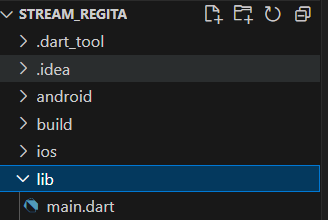
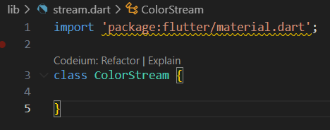
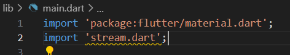
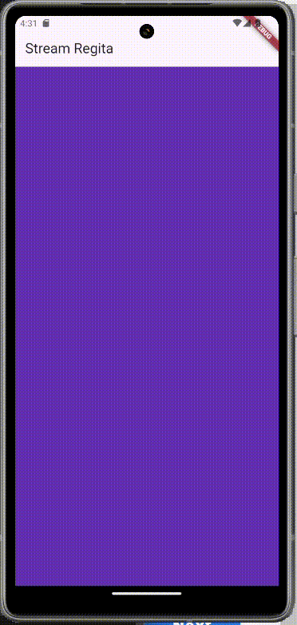
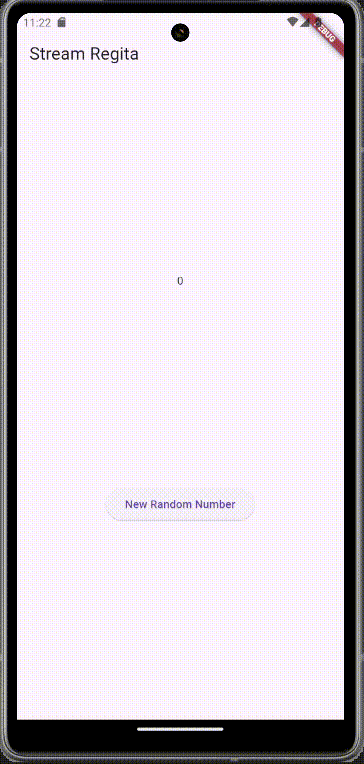

### Nama : Regita Delya Putri

### Absen : 21

### NIM : 2241720137

### Kelas : TI 3F

### Pertemuan: 12 (Streams)

---

# Praktikum 1: Dart Streams

## Langkah 1: Buat Project Baru

Output:



## Langkah 2: Buka file main.dart

```
import 'package:flutter/material.dart';

void main() {
  runApp(const MyApp());
}

class MyApp extends StatelessWidget {
  const MyApp({super.key});

  // This widget is the root of your application.
  @override
  Widget build(BuildContext context) {
    return MaterialApp(
      title: 'Stream Regita',
      theme: ThemeData(
        primarySwatch: Colors.deepPurple,
      ),
      home: const StreamHomePage(),
    );
  }
}

class StreamHomePage extends StatefulWidget {
  const StreamHomePage({super.key});

  @override
  State<StreamHomePage> createState() => _StreamHomePageState();
}

class _StreamHomePageState extends State<StreamHomePage> {
  @override
  Widget build(BuildContext context) {
    return Container();
  }
}
```

**Soal 1**
- Tambahkan nama panggilan Anda pada title app sebagai identitas hasil pekerjaan Anda.

`Jawaban:`

```
Widget build(BuildContext context) {
    return MaterialApp(
      title: 'Stream Regita', // Nama: Regita
      theme: ThemeData(
        primarySwatch: Colors.brown,
      ),
      home: const StreamHomePage(),
    );
  }
```

- Gantilah warna tema aplikasi sesuai kesukaan Anda.

`Jawaban:`

```
Widget build(BuildContext context) {
    return MaterialApp(
      title: 'Stream Regita',
      theme: ThemeData(
        primarySwatch: Colors.brown, Color: Brown
      ),
      home: const StreamHomePage(),
    );
  }
```

- Lakukan commit hasil jawaban Soal 1 dengan pesan "W12: Jawaban Soal 1"

## Langkah 3: Buat file baru stream.dart

Output:



## Langkah 4: Tambah variabel colors

```
class ColorStream {
  final List<Color> colors = [
    Colors.blueGrey,
    Colors.amber,
    Colors.deepPurple,
    Colors.lightBlue,
    Colors.teal
  ];
}
```

**Soal 2**
- Tambahkan 5 warna lainnya sesuai keinginan Anda pada variabel colors tersebut.

```
class ColorStream {
  final List<Color> colors = [
    Colors.blueGrey,
    Colors.amber,
    Colors.deepPurple,
    Colors.lightBlue,
    Colors.teal,
    Colors.indigo,
    Colors.redAccent,
    Colors.greenAccent,
    Colors.pink,
    Colors.lime
  ];
}
```

- Lakukan commit hasil jawaban Soal 2 dengan pesan "W12: Jawaban Soal 2"

## Langkah 5: Tambah method getColors()

```
Stream<Color> getColors() async* {
    
}
```

## Langkah 6: Tambah perintah yield*

```
  Stream<Color> getColors() async* {
    yield* Stream.periodic(const Duration(seconds: 1), (int t) {
      int index = t % colors.length;
      return colors[index];
    });
  }
```

**Soal 3**
- Jelaskan fungsi keyword yield* pada kode tersebut!

`Jawaban:`

Meneruskan seluruh elemen dari stream yang dihasilkan Stream.periodic ke dalam stream getColors.

- Apa maksud isi perintah kode tersebut?

`Jawaban:` 

Menghasilkan stream warna-warna dalam urutan siklik dari array colors setiap detik.

- Lakukan commit hasil jawaban Soal 3 dengan pesan "W12: Jawaban Soal 3"

## Langkah 7: Buka main.dart

Output:



## Langkah 8: Tambah variabel

```
class _StreamHomePageState extends State<StreamHomePage> {
  Color bgColor = Colors.blueGrey;
  late ColorStream colorStream;
```

## Langkah 9: Tambah method changeColor()

```
  void changeColor() async {
    await for (var eventColor in colorStream.getColors()) {
      setState(() {
        bgColor = eventColor;
      });
    }
  }
```

## Langkah 10: Lakukan override initState()

```
  @override
  void initState() {
    super.initState();
    colorStream = ColorStream();
    changeColor();
  }
```

## Langkah 11: Ubah isi Scaffold()

```
Widget build(BuildContext context) {
    return Scaffold(
      appBar: AppBar(
        title: const Text('Stream Regita'),
      ),
      body: Container(
        decoration: BoxDecoration(color: bgColor),
      ),
    );
  }
```

## Langkah 12: Run

**Soal 4**
- Capture hasil praktikum Anda berupa GIF dan lampirkan di README.

Output:



- Lakukan commit hasil jawaban Soal 4 dengan pesan "W12: Jawaban Soal 4"

## Langkah 13: Ganti isi method changeColor()

```
  void changeColor() async {
    colorStream.getColors().listen((eventColor) {
      setState(() {
        bgColor = eventColor;
      });
    });
  }
```

**Soal 5**

- Jelaskan perbedaan menggunakan listen dan await for (langkah 9) !

`Jawaban:`

Perbedaan antara listen dan await for terletak pada cara mereka mengonsumsi dan menangani stream dalam Dart. listen digunakan untuk berlangganan ke stream dan menangani setiap data yang diterima melalui callback. Dengan listen, kita dapat menangani berbagai event seperti data yang diterima, error yang terjadi, dan akhir dari stream menggunakan parameter onData, onError, dan onDone. Ini memberikan kontrol yang lebih besar terhadap aliran data dan memungkinkan pengelolaan lebih lanjut, tetapi memerlukan penanganan manual untuk setiap event yang mungkin terjadi.

Di sisi lain, await for digunakan dalam loop asinkron untuk secara langsung menunggu dan memproses setiap elemen yang dihasilkan oleh stream. Ini lebih sederhana dan lebih mudah dibaca, karena kita hanya perlu menunggu data yang diterima dan memprosesnya, tanpa perlu menangani callback secara eksplisit. Namun, await for lebih terbatas karena tidak dapat menangani error atau status lainnya seperti penutupan stream. Jika hanya membutuhkan pengolahan data secara berurutan tanpa perlu penanganan error atau status stream, await for adalah pilihan yang lebih ringkas.

- Lakukan commit hasil jawaban Soal 5 dengan pesan "W12: Jawaban Soal 5"


# Praktikum 2: Stream controllers dan sinks

## Langkah 1: Buka file stream.dart
Lakukan impor dengan mengetik kode ini.

```
import 'dart:async';
```

## Langkah 2: Tambah class NumberStream
Tetap di file stream.dart tambah class baru seperti berikut.

```
class NumberStream {
}
```

## Langkah 3: Tambah StreamController

```
class NumberStream {
  final StreamController<int> controller = StreamController<int>();
}
```

## Langkah 4: Tambah method addNumberToSink

```
class NumberStream {
  final StreamController<int> controller = StreamController<int>();

  void addNumberToSink(int newNumber) {
    controller.sink.add(newNumber);
  }
}
```

## Langkah 5: Tambah method close()

```
class NumberStream {
  final StreamController<int> controller = StreamController<int>();

  void addNumberToSink(int newNumber) {
    controller.sink.add(newNumber);
  }

  close() {
    controller.close();
  }
}
```

## Langkah 6: Buka main.dart

```
import 'dart:async';
import 'dart:math';
```

## Langkah 7: Tambah variabel

Di dalam class _StreamHomePageState ketik variabel berikut

```
int lastNumber = 0;
late StreamController numberStreamController;
late NumberStream numberStream;
```

## Langkah 8: Edit initState()

```
  @override
  void initState() {
    numberStream = NumberStream();
    numberStreamController = numberStream.controller;
    Stream stream = numberStreamController.stream;
    stream.listen((event) {
      setState(() {
        lastNumber = event;
      });
    });
    super.initState();
  }
```

## Langkah 9: Edit dispose()

```
  @override
  void dispose() {
    numberStreamController.close();
    super.dispose();
  }
```

## Langkah 10: Tambah method addRandomNumber()

```
void addRandomNumber() {
  Random random = Random();
  int myNum = random.nextInt(10);
  numberStream.addNumberToSink(myNum);
} 
```

## Langkah 11: Edit method build()

```
  @override
  Widget build(BuildContext context) {
    return Scaffold(
      appBar: AppBar(
        title: const Text('Stream Regita'),
      ),
      body: SizedBox(
          width: double.infinity,
          child: Column(
            mainAxisAlignment: MainAxisAlignment.spaceEvenly,
            crossAxisAlignment: CrossAxisAlignment.center,
            children: [
              Text(lastNumber.toString()),
              ElevatedButton(
                onPressed: () => addRandomNumber(),
                child: Text('New Random Number'),
              )
            ],
          )
        ),
    );
  }
```

## Langkah 12: Run
Output:



**Soal 6**

- Jelaskan maksud kode langkah 8 dan 10 tersebut!

`Jawaban:`

Pada langkah 8, fungsi initState mengatur alur stream untuk mendengarkan data yang dikirimkan dari objek NumberStream. Stream controller dari NumberStream digunakan untuk membuat stream, yang kemudian dilanggan menggunakan stream.listen. Setiap kali stream menerima angka baru, callback yang diterapkan akan memperbarui state aplikasi melalui setState, menyimpan angka terbaru ke variabel lastNumber, sehingga UI akan diperbarui. Fungsi ini memastikan bahwa widget terintegrasi dengan aliran data secara dinamis sejak inisialisasi.

Pada langkah 10, metode addRandomNumber digunakan untuk menghasilkan angka acak dalam rentang 0 hingga 9 menggunakan kelas Random dan mengirim angka tersebut ke sink stream melalui metode addNumberToSink dari NumberStream. Angka yang ditambahkan ini kemudian akan diteruskan melalui stream, sehingga listener yang sudah ditentukan (seperti di langkah 8) dapat menerima dan memprosesnya, memungkinkan interaksi dinamis antara data dan UI.

- Capture hasil praktikum Anda berupa GIF dan lampirkan di README.

- Lalu lakukan commit dengan pesan "W12: Jawaban Soal 6".
## Langkah 13: Buka stream.dart

## Langkah 14: Buka main.dart

## Langkah 15: Edit method addRandomNumber()
